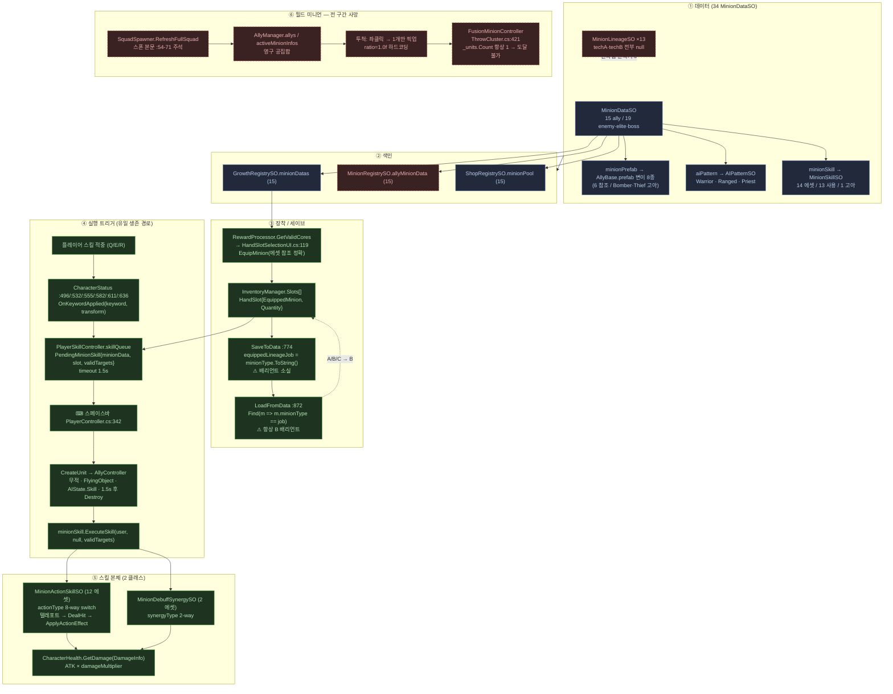

Verified everything I needed. Writing the merged document.

---

# Necromancer_3 — 미니언 / 미니언 스킬 구조 아키텍처 맵

> **문서 지위**: 원래 7개 레이어로 계획되었으나 실제 산출된 것은 3개(데이터/런타임/스킬)이며, 나머지 4개는 존재하지 않는다(디스크에 아무 산출물 없음 — 재실행이 아니라 신규 작성이 필요했다). 그 공백 중 가장 하중이 큰 **투척 서브시스템**은 이 문서를 위해 직접 매핑했다. 아래 내용은 레이어 리포트 + 갭 조사 + 본인의 재검증을 병합한 것이며, **레이어 간 모순은 각 절 말미의 `모순 해소` 박스에서 명시적으로 판정**했다.

---

## 1. 한눈에 보기

미니언 하나는 `MinionDataSO` 에셋 1개다(`Scripts/SOData/Define/MinionDataSO.cs:8`) — 상속도 배리언트 필드도 없는 25개 필드짜리 평평한 가방이며, 프리팹(`minionPrefab`) · 두뇌(`aiPattern`) · 반응 스킬(`minionSkill`) 3개의 참조를 조합한다. 데이터는 `GrowthRegistrySO.minionDatas`(보상/상점/인벤토리)와 `MinionRegistrySO.allyMinionData`(전투/스폰)라는 **동일한 15개 GUID를 담은 두 개의 독립 레지스트리**로 색인되고, 보상 UI가 손 슬롯(`HandSlot`)에 에셋 참조를 직접 꽂으면 `InventoryManager.OnMinionUpdated` → `PlayerSkillController.SyncWithInventory()`(`:130`)가 Q/E/R 3칸 배열로 복사한다. 여기서부터가 이 시스템의 핵심 반전이다 — **필드에 상주하는 미니언을 만드는 살아있는 코드는 존재하지 않는다**. `SquadSpawner`의 스폰 본문과 `AllyManager`의 리스폰 큐는 전부 주석 블록 안에 있고(`SquadSpawner.cs:54-71`, `AllyManager.cs:37`), 유일하게 `AllyController`를 생성하는 살아있는 경로는 `PlayerSkillController.cs:404`의 **1.5초짜리 일회용 스킬 꼭두각시**뿐이다. 따라서 게임의 전제인 "해골을 소환해서 집어던진다"에서 던질 대상은 런타임에 땅 위에 서 있질 않으며, 살아있는 투척(좌클릭 → `ThrowInputHandler.cs:147`)이 실제로 집는 것은 `ThrowableBox`/`ThrowableBoneSpear`/`PoisonPotionThrowable` 같은 비-미니언 오브젝트뿐이다. 그 결과 미니언의 정체성 전체 — A/B/C 배리언트를 가르는 유일한 필드인 `minionSkill` — 은 **미니언 자신이 아니라 플레이어의 키워드 반응 큐를 통해서만 표현된다**: 플레이어 스킬이 적중 → `CharacterStatus`가 키워드 부여 → `OnKeywordApplied`로 큐 적재 → **스페이스바**(`PlayerController.cs:342`) → 임시 미니언 생성 → `minionSkill.ExecuteSkill(user, null, validTargets)` → 텔레포트 후 타격 → 1.5초 뒤 파괴. 그리고 그 14개 스킬 에셋은 전부 단 **2개의 C# 클래스**(`MinionActionSkillSO`의 8-way enum switch + `MinionDebuffSynergySO`)로 구동되는, 플레이어 스킬(22 에셋 ≈ 22 전용 클래스)과 정확히 거울상인 데이터 주도 구조다.



---

## 2. 데이터 계층

### 2.1 `MinionDataSO` — 전 필드와 그 의미

`Scripts/SOData/Define/MinionDataSO.cs:8`. 헤더 주석 `:4`은 이 타입이 **아군/적군 공용 마스터 데이터**임을 명시한다 — 적, 엘리트, 보스가 모두 이 한 타입을 쓰며 폴더와 `isElite` 플래그로만 갈린다.

| 필드 | 선언 | 의미 / 판독처 | 상태 |
|---|---|---|---|
| `minionSkill` | `:12` | 투척 반응 스킬. **A/B/C 배리언트를 가르는 유일한 필드.** `PlayerSkillController.cs:227,398,430`에서만 판독 | LIVE |
| `minionType` | `:15` | `CommandData` 직업 enum. 유일한 그룹핑 키 | LIVE |
| `minionName` | `:16` | 표시명. `RegistryMenuTools.cs:48`의 보스 판정에도 쓰임 | LIVE |
| `minionIcon` | `:17` | 주석 "대가리만 달린 이미지". `MinionStateUI.cs:72,110`, `SkillExplainUI.cs:128` 폴백 | LIVE |
| `baseEffectValue` | `:20` | 투척 효과 크기. 주석: 전사=추가 데미지, 궁수=범위, 사제/방패/창병=CC/쉴드/넉백 수치. **투척 경로가 읽는 유일한 필드** (`ThrowStrategy.cs:233`) | LIVE |
| `maxHP` `attack` `attackSpeed` `attackRange` `detectRange` `defense` `flatDefense` `moveSpeed` `baseEvasion` `baseMissChance` | `:23-32` | `CharacterStat.InitializeStats` `:340-350`이 private base* 필드로 복사 | LIVE |
| `cost` | `:33` | 판독기 0. 폐기된 `SummonController` 소환 경제의 잔재 | **DEAD** |
| `isElite` | `:35` | `[FormerlySerializedAs("isBoss")]`. `CharacterStat.cs:353`, `EliteRoomEvent.cs:46`, `SiegeModeSkill.cs:238`, `RegistryMenuTools.cs:58` | LIVE |
| `canSpawnRandomly` | `:36` | 34개 에셋 전부에 의도적으로 저작(엘리트/보스 0, 나머지 1)되어 있으나 **판독 코드 0** | **DEAD** |
| `aiPattern` | `:39` | `AIPatternSO`. `BaseEntity.cs:312`에서 엔티티별 클론 | LIVE |
| `hpCostRatioPerThrow` | `:43` | 투척 1회당 소모 최대 HP 비율. `AllyController.cs:176`. **Magician 2종만 1.0 저작** | LIVE |
| `AttackSound` | `:46` | `BaseEntity.cs:99` | LIVE |
| `DeathSound` | `:47` | 판독기 0, 전 에셋 null | **DEAD** |
| `minionPrefab` | `:50` | `DataManager.cs:66-67`이 유일 판독 | LIVE |
| `shopCost = 150` | `:53` | `RewardProcessor.cs:174`. **34개 에셋 전부에 키 부재** → 전원 150 균일 | LIVE(폴백) |
| `rewardItemData` | `:54` | `GrowthItemData`. **전 에셋 미저작** → 소비자 3곳 모두 이미 폴백 사용 | 사실상 vestigial |

`rewardItemData`가 vestigial이라는 근거는 소비자 쪽에 있다: `InventoryManager.cs:29-31`이 `baseData.itemName`이 비면 `EquippedMinion.minionName`으로, `baseData.icon`이 null이면 `minionIcon`으로 대체하고, 같은 폴백이 `RewardProcessor.cs:281-282`, `GemSlotSelectionItem.cs:29`에도 있다. **폴백이 곧 라이브 경로다.** (부기: `GrowthItemData`는 `[System.Serializable]` 클래스이므로 Unity가 항상 기본 생성한다 — `:29`의 `baseData != null` 검사는 언제나 참이고 실질 가드는 문자열 검사뿐이다.)

### 2.2 A/B/C 계보 — 계보가 아니다

**이 문서에서 가장 중요한 데이터 사실**: A/B/C는 티어도 승급도 아니다. 같은 직업 안에서 A/B/C 에셋은 **`minionSkill` GUID 한 줄을 빼면 바이트 단위로 동일**하다 — 같은 프리팹, 같은 스탯, 같은 AI 패턴, 같은 아이콘, 같은 `minionName`. Warrior 3종 `diff`는 `m_Name`과 `minionSkill` 딱 두 줄만 반환한다:

| 에셋 | `minionSkill` → |
|---|---|
| `SOData/Minion/MinionData/Warrior Minion.asset:15` | `A_Warrior_CorrosionSlash.asset` |
| `Warrior Minion B.asset:15` | `MinionReaction_Type1_Damage.asset` |
| `Warrior Minion C.asset:15` | `MinionDebuffSynergyStack.asset` |

그런데 `MinionDataSO`에는 **어떤 에셋이 어느 배리언트인지 기록하는 필드가 없다**. 배리언트 축은 파일명 접미사로만 존재한다. 그 결과 §6의 세이브 왕복 붕괴와 §10의 직업 키 조회 붕괴가 발생한다.

`MinionLineageSO`(`Scripts/Systems/Growth/Data/MinionLineageSO.cs:25`)가 `baseForm → techA → techB` 진화 트리를 선언하지만 **13개 계보 에셋 전부 `techA: {fileID: 0}` / `techB: {fileID: 0}`**이고, 타입 참조는 `Editor/GemTranslationPipeline.cs`(`:54,60,187,192`, 로컬라이제이션 스윕) 4곳뿐 — **런타임 판독기 0**. `RewardProcessor.cs:111`이 못을 박는다: `case RewardCategory.Metamorphosis:` 본문이 주석 `"변이/승급 시스템 삭제로 아무것도 생성 안함"` + `break;`뿐. `RewardManager.cs:130`도 반복: *"Metamorphosis is unused for now; every minion reward always opens the hand-slot picker (swap-based design)"*. 실제 저작 형태는 스키마 의도의 정반대다 — A/B/C가 **각자 baseForm만 가진 별개의 계보 에셋**으로 모델링되어 있다(`Warrior Lineage.asset:18` → Warrior Minion, `Warrior Lineage B.asset:18` → Warrior Minion B).

### 2.3 아군 에셋 인벤토리 (15종, `SOData/Minion/MinionData/`)

전 에셋 공통: `maxHP 100, attack 5, attackSpeed 1, detectRange 10, defense 0, flatDefense 0, moveSpeed 5, baseEvasion 0, baseMissChance 0, cost 1, isElite 0, canSpawnRandomly 1, DeathSound null`. **오직** `baseEffectValue`, `attackRange`, `aiPattern`, `minionPrefab`, `minionIcon`, `minionSkill`만 변한다.

| 직업 (`CommandData`) | 프리팹 | AI 패턴 | `baseEffectValue` / `attackRange` | 에셋 → `minionSkill` |
|---|---|---|---|---|
| **Warrior** (0) | `Ally/1CommandSummon/SkeletonWarrior` | Warrior | 10 / 2 | Warrior Minion → `A_Warrior_CorrosionSlash`<br/>Warrior Minion B → `MinionReaction_Type1_Damage`<br/>Warrior Minion C → `MinionDebuffSynergyStack` |
| **Shieldbearer** (1) | `1CommandSummon/SkeletonShieldbearer` | Warrior | 10 / 2 | ShieldBearer Minion → `B_Shield_LeapStrike`<br/>ShieldBearer Minion B → `MinionReaction_Type7_SmashExt` |
| **Archer** (2) | `1CommandSummon/SkeletonArcher` | Ranged | 3 / 8 | Archer Minion → `MinionReaction_Type4_3_Smash`<br/>Archer Minion B → `MinionReaction_Type2_1_Push` |
| **Priest** (3) | `1CommandSummon/SkeletonPriest` | Priest | 0.3 / 8 | Priest Minion → `MinionReaction_Type4_1_Stun`<br/>Priest Minion B → `MinionReaction_Type6_StrikeExt`<br/>Priest Minion C → `MinionReaction_Type2_2_Pull` |
| **Spearman** (5) | `2CommandSummon/SkeletonSpearman` | Warrior | 10 / 2 | Spearman Minion → `C_Spear_StunThrust`<br/>Spearman Minion B → `MinionDebuffSynergyDamage`<br/>Spearman Minion C → `MinionReaction_Type5_StunExt` |
| **Magician** (6) | `2CommandSummon/SkeletonMagician` | **Warrior** | 1 / **2** | Magician Minion → `MinionReaction_Type2_2_Pull`<br/>Magician Minion B → `MinionReaction_Type5_StunExt` |
| **Bomber** (4) | 프리팹·아트 존재, **MinionDataSO 없음** | — | — | — |
| **Thief** (7) | 프리팹·아트 존재, **MinionDataSO 없음** (적 에셋만 존재) | — | — | — |

**교차 직업 스킬 공유** — `minionSkill`이 유일한 차별자이므로 이 두 쌍은 스프라이트와 `attackRange`만 다른 **기능적 동일 미니언**이다:
- `MinionReaction_Type2_2_Pull.asset` (guid `ef79065e…`) → **Magician Minion** + **Priest Minion C**
- `MinionReaction_Type5_StunExt.asset` (guid `8963711745…`) → **Magician Minion B** + **Spearman Minion C**

**Bomber/Thief는 "없는 직업"이 아니라 "짓다 만 콘텐츠"다.** `Resources/Sprites/Old/Skull_Character_32px.png.meta`가 8개 직업 전부의 서브스프라이트를 저작하고 있고(`:234/:250` `Skull_Bomber` internalID `1901745487537557777`, `:256/:272` `Skull_Thief` `5465635376871961743`), 두 프리팹이 정확히 그 ID를 참조한다(`SkeletonBomber.prefab:14`, `SkeletonThief.prefab:14`). git이 시점을 특정한다 — 8개 프리팹 전부 `b69d7a1` "소환 시스템 완료" / `1b33496` "2티어 소환수 추가"에서 함께 태어나 `d5f8688` "스프라이트 간단 적용"에서 아트를 받았으나, Magician만 이후 `4cf008b` **AnimationSprite추가** + `034e7a1` **애니메이션 공격 바인딩** 패스를 받았고 Bomber/Thief는 그 패스에서 누락됐다. **`CommandData.SkeletonBomber`/`SkeletonThief`를 "미사용 enum 값"으로 삭제하면 안 된다.**

### 2.4 적/엘리트/보스 (19종, `SOData/Enemy/Enemy Minion Data/`)

`Enemy Charger Minion`(0), `Enemy Homing Magician Minion`(6), `Enemy Magician Minion`(6), `Enemy Priest Minion`(3), `Enemy Scarecrow`(0, maxHP 1e+20), `Enemy Small Lion`(0, 이름 "Enemy Small Slime"), `Enemy Small Mask`(0, 이름 "Enemy Small Slime"), `Enemy Thief Minion`(7), `Monster Doll Melee`(0), `Monster Doll Range`(2), `Monster LionMask`(0); `Boss/Bone Master Data`(0), `Boss/Bone Master Phase 2 Data`(0); `Elites/Archer/Archer Elite Data`(0, isElite), `Archer Elite Phase 2 Data`(0, isElite), `Elites/Charger/Charger Elite Data`(0, isElite), `Elites/Summoner/Summoner Elite Data`(0, isElite), `Elites/Summoner/Summoner Elite Minion`(0, **isElite 아님**), `Elites/Warrior/Warrior Elite Data`(**minionType 100=None**, isElite).

### 2.5 레지스트리 — 같은 15개를 3벌

| 레지스트리 | 에셋 | 내용 | 런타임 판독 |
|---|---|---|---|
| `MinionRegistrySO` `:8` | `SOData/Registry/Minion Registry.asset` | ally 15 / enemy 9 / elite 1 / boss 2 | `DataManager.cs:24-27`. **`allyMinionData`는 소비자 0** |
| `GrowthRegistrySO` `:8` | `SOData/Registry/Growth Reward Registry.asset` | `minionDatas` 15(= ally와 동일 GUID·동일 순서), `playerSkills` 22, `gems`/`treasures`/`specialAbilities` **전부 `[]`** | `RewardProcessor`, `InventoryManager.cs:872` |
| `ShopRegistrySO` | `Shop Registry.asset:47-61` | `minionPool` 15 (또 같은 것) | 상점 |

두 레지스트리는 **서로 다르고 모순되는 에디터 루틴**으로 채워진다: `RegistryMenuTools.cs:37`은 경로 부분문자열(`"/SOData/Minion/"`, `"/SOData/Enemy/"`)로 분류하는 반면, `GrowthRegistrySO.RefreshRegistry`(`:50`)는 **경로 필터 없는** `AssetDatabase.FindAssets("t:MinionDataSO")` — 즉 적/엘리트/보스 19종을 전부 `minionDatas`로 쓸어담아 `RewardProcessor.GetValidCores`에 플레이어 보상으로 먹인다. 디스크의 에셋에는 아군 15종만 있으므로 **이 메뉴는 최근 실행된 적이 없다**.

`Minion Registry.asset`은 자기 생성 도구에 대해 **stale**하다: `eliteMinionData`에 `Charger Elite Data` 1개뿐(`:42`)이나 `isElite: 1`인 에셋은 4개이고, `enemyMinionData`는 `Enemy Priest Minion`/`Enemy Scarecrow`/`Enemy Thief Minion`을 누락했다. **`EliteRoomEvent.cs:51`은 오늘 4개 엘리트 중 1개만 본다.**

> **📌 모순 해소 — Bomber/Thief**
> Layer 1의 *"Bomber(4)와 Thief(7): 아군 에셋 없음"* 및 *"Bomber는 어디에도 에셋 없음"*은 **`MinionDataSO`에 한해서만 옳고, 표현으로서는 틀렸다.** `Prefabs/Ally/2CommandSummon/SkeletonBomber.prefab`과 `SkeletonThief.prefab`이 AllyBase 변이로 실재하며 전용 아트까지 바인딩되어 있다(§2.3). 정정된 서술: **"프리팹+아트 존재, MinionDataSO·오버라이드 컨트롤러 없음, 어떤 레지스트리도 참조 안 함, 죽은 `SummonController` 코드로만 도달 가능."**

---

## 3. 런타임 계층

### 3.1 프리팹 구조 — 상속은 Unity 변이로

8개 직업 프리팹은 전부 `Prefabs/Ally/AllyBase.prefab`의 **Unity 프리팹 변이**다. 8개 모두 `m_SourcePrefab: {fileID: 100100000, guid: 501e8ce388ec2bf45a9d0a1e2868c9ed}`(= `AllyBase.prefab.meta:2`)를 단일 `!u!1001 PrefabInstance` 문서로 갖고, `m_RemovedComponents`/`m_AddedComponents`/`m_AddedGameObjects` 전부 공집합 — **순수 프로퍼티 오버라이드, 구조적 분기 0**.

**그런데 오버라이드 목록 자체가 썩었다.** 오버라이드 타깃 2개가 `AllyBase.prefab`에 존재하지 않으며 리포지토리 어디에도 없다:

| 유령 타깃 | 싣고 있는 프로퍼티 | 존재하는 변이 |
|---|---|---|
| `121906001500000748` | `m_Sprite`, `m_Color.r/g/b`, `m_Materials.Array.data[0]` | **8개 전부** |
| `4018896265268374098` | `m_Controller` | 6개 (Bomber/Thief 제외) |

AllyBase에는 중첩 프리팹도 `!u!1001` 블록도 없으므로 이들은 해석 불가 — **이전 AllyBase 계층에서 스프라이트/애니메이터 오브젝트가 재생성됐을 때 남은 stale 오버라이드**다. 살아있는 대응물은 현재 루트 컴포넌트를 향한다: SpriteRenderer `1348199348988540393`(`AllyBase.prefab:492`), Animator `9061937502379027960`(`:547`).

귀결: **머티리얼 오버라이드는 8개 전부 죽었다**(살아있는 SpriteRenderer를 덮는 변이가 없음). **Bomber/Thief는 `m_Color`도 죽어서** AllyBase 기본 틴트 `{r:0, g:1, b:0.104, a:1}`(`:537`) — 형광 초록 — 을 상속한다. 이 stale 오버라이드들은 **에디터에서 열고 저장하는 순간 조용히 사라진다**.

부기: `CharacterStatStuff`(GO `2048275137793000749`, `AllyBase.prefab:153-169`) 하위 8개 fileID를 8개 변이 전부에 대해 grep한 결과 **0 hit** — 변이는 스탯 서브트리를 전혀 오버라이드하지 않으므로 그쪽 재구조화는 오버라이드 타깃을 깨지 않는다. fileID 취약성은 **이미 터졌고**, 터진 곳은 루트 SpriteRenderer/Animator다.

### 3.2 `AllyController` 생애주기

`Scripts/Entities/AllyController.cs:8` — `BaseEntity, IThrowable`. **중간 클래스 없음**(`BaseEntity`가 유일한 부모, `Scripts/Entities/BaseEntity.cs:15`).

| 단계 | 코드 | 하는 일 |
|---|---|---|
| Awake | `:40-52` | ArcMovement 캐시, `_originalLayer`/`_originalDamping`/`_originalSortingLayerName` 저장, 태그 `"Player"`로 플레이어 탐색(`:44`), `team = Team.Ally` **강제** (`:51`) |
| Initialize | `BaseEntity.cs:295-321` | `minionData = data`(`:297`) → `_stats.InitializeStats(data)`(`:299`) → `patternToUse = data.aiPattern`, null이면 `DataManager.DEFAULT_AI_PATTERN`(`:306`) → **`_runtimeBrain = Instantiate(patternToUse)`**(`:312`, 엔티티별 클론) → `_runtimeBrain.Init(this)` → `_nearestFinder.targetLayer = opponentLayer`(`:320`) |
| Update | `BaseEntity.cs:193-245` | `CanExecuteAI` 게이트 → 스턴 제동 → 공포 → `_runtimeBrain.Execute(this)`(`:243`) |
| OnPickedUp | `:80-106` | brain→`Caught`, 레이어 재귀 `FlyingObject`, `rb.simulated=false`, **모든** 자식 콜라이더 비활성, agent 비활성 |
| OnThrown | `:126-166` | brain→`Thrown`, 타깃 방향 flipX, sorting layer `FlyingObject`, 물리 OFF (**클러스터가 이동 소유**, `:150-156` 주석이 개별 물리 제거를 명시) |
| ApplyThrowCost | `:173-189` | `hpCostRatioPerThrow <= 0`이면 early-return(`:175`) → `damageAmount = MAXHP × ratio` → **`DamageType.Fixed`로 자기 피격**(`:188`) |
| OnLanded | `:191-222` | 레이어/sorting/agent(`NavMesh.SamplePosition`+`Warp`)/rb/콜라이더 복구 후 **`_runtimeBrain.Init(this)`** — 완전 두뇌 리셋(Idle, AtkTimer=1000 → 착지 즉시 공격) |
| EnterSkillState | `:227-234` | brain→`Skill`, agent 비활성. 무적 처리는 `:233`에 **주석 처리** |
| ExitSkillState | `:236-248` | agent 재활성 + `_runtimeBrain.Init(this)` |
| OnDestroy | `BaseEntity.cs:323-327` | **클론 SO 파괴** (ScriptableObject는 GameObject와 함께 GC되지 않음) |

`ApplyThrowCost`의 Warrior_Executioner 시너지 할인(`:179-186`)은 **현재 데이터로 도달 불가**: 할인 분기는 `minionType == SkeletonWarrior`를 요구하나 Warrior 3종은 전부 `hpCostRatioPerThrow: 0`이라 `:175`에서 early-return하고, `1`인 유일한 에셋(Magician 2종)은 `minionType: 6`이라 조건을 못 만족한다. 그리고 Magician의 `1` × `DamageType.Fixed`는 **투척 1회에 즉사**를 뜻한다.

### 3.3 AI 패턴 두뇌

`AIPatternSO`(`Scripts/SOData/Define/AIPatternSO/AIPatternSO.cs:10`) — 헤더: *"모든 행동 판단과 실행의 '단일 진실 공급원'"*. `enum AIState { Idle, Follow, Attack, Caught, Thrown, Skill }`(`:4`).

**형식적 FSM이 아니다**: `Idle`/`Follow`/`Attack`은 패턴이 매 프레임 결정하고, `Caught`/`Thrown`/`Skill`은 오직 외부에서 `SetState`로 강제되며 모든 AI를 하드 리턴시킨다(`:71`).

`Execute`(`:30-91`) 흐름: `AtkTimer += deltaTime`(`:33`) → `UpdateAnimation` → `testMode_DisableAutoBattle` 분기(`:39-63`, **비활성** — `GameManager.prefab:260`이 `0` 저작) → `LookAtTarget`(`:65-68`) → **Thrown/Caught/Skill이면 하드 리턴**(`:71`) → 무효 타깃 제거(`:74-77`) → `UpdateTargeting` → `UpdateStateTransitions` → `OnIdle`/`OnFollow`/`OnAttack` 스위치.

| 구현체 | 에셋 | 사용 직업 | 특이점 |
|---|---|---|---|
| `BaseAIPatternSO` `:9` | `Warrior Pattern.asset` (guid `87dce675…`) | Warrior, ShieldBearer, Spearman, **Magician** | 표준 두뇌. `AttackRoutine` `:130-249`가 Attack 클립 길이를 읽어 `Animator.speed`를 `ATKSPD×0.9`에 맞춤 |
| `RangedAIPatternSO` `:7` | `Ranged Pattern.asset` (guid `d714e9ff…`) | Archer | `ExecuteBasicAttack` `:68-90`을 **완전 오버라이드**해 `Projectile` 발사 → `entity.ExecuteAttack` 미호출. `OnEnable` `:22`에서 `spawnTelegraph=false` 강제 |
| `PriestAIPatternSO` `:7` | `Priest Pattern.asset` (guid `af7c5725…`) | Priest | `OnAttack` `:91-119` 오버라이드 — 힐만, `base.OnAttack` 미호출 → **`AttackRoutine` 자체를 안 탄다**. `:95`에서 `AtkTimer += Time.deltaTime`을 **두 번째로** 증가시키는 버그(`Execute:33`이 이미 함) |

### 3.4 타게팅

`NearestTargetFinder`(`Scripts/NearestTargetFinder.cs:3`) — `scanInterval=0.2`(`:8`) + ±0.02 지터(`:31`)로 프레임 분산, 스캔 사이엔 **캐시 반환**(`:38-39`), 무할당 `Physics2D.OverlapCircle`을 고정 10슬롯 버퍼로(`:14` — 주석은 20이라 주장하는 하드 캡).

**죽은 필터**: `:74-77`의 사망/무적 사전 필터는 **콜라이더 GameObject에만** `TryGetComponent<CharacterStat>()`를 건다 — 부모/자식 탐색 없음. 나는 양쪽 프리팹에서 구조적으로 검증했다: AllyBase는 CircleCollider2D+Rigidbody2D가 루트 GO(`5144142430907504354`)에, CharacterStat은 자식 `CharacterStatStuff`(`2048275137793000749`)에 있다. Enemy.prefab도 콜라이더는 루트(`1841339908024047631`), 스탯은 별도 GO(`7801305212508034253`). **CharacterStat이 콜라이더 GO에 있는 경우가 없으므로 이 필터는 한 번도 발동한 적이 없다.** 사망 타깃은 나중에 `AIPatternSO.IsTargetInvalid`(`:161-195`)가 올바른 `GetComponentInParent`/`InChildren`으로 걸러낸다.

### 3.5 스탯

`CharacterStat.InitializeStats`(`:334-361`) → `Setup()`(`:298-327`) → **`if (data != null && !IsFusion)`** 가드 하에 `:340-350`이 base* 필드로 복사 → `Status.IsElite = data.isElite`(`:353`) → `Health.ResetHP` + `Status.ClearStatus` + `Visual.ResetVisuals`. `!IsFusion` 가드가 `FusionMinionController`의 `OverrideBaseStats`를 재-Initialize에서 살려주는 장치다.

읽을 때 젬/보물 보너스가 얹힌다: `ATK`(`:66-`) `= base × aging × corrosion × (1 + GetGemBonus(Attack) + GetTreasureBonus(GlobalMinionStats))`.

**젬 질의 표면이 두 층으로 갈리고 생사가 반대다** — 리팩토링 시 실질적 함정: `GemRuleSystem`은 전부 스텁(`:17,31,38,59,95,102,114,122,141,167,188`이 `int level = 0;`, `:171-174` `ShouldAgingInstaKill`은 `return false`)인 반면 `InventoryManager.GetSynergyCount`(`:411-414`) / `HasUniqueEffect`(`:462-465`)는 **진짜**다(`CalculateSynergies` `:291-309`가 실제로 딕셔너리를 채움). 미니언 코드는 둘을 섞어 쓴다: `AllyController.cs:181`과 `CharacterStat.ShieldbearerSelfMult:47`은 `GemRuleSystem`을 우회해 `InventoryManager`를 직접 호출하고, `CharacterStat.ATK:70`과 `MOVESPEED:189-190`은 스텁된 `GemRuleSystem`을 탄다.

### 3.6 `FusionMinionController`

`Scripts/Entities/FusionMinionController.cs:4` — **평범한 MonoBehaviour**. `BaseEntity`도 두뇌도 AI도 타게팅도 없는, 복제된 미니언 GameObject 위의 스탯 자루. 어떤 프리팹에도 저작되어 있지 않고 오직 `ThrowCluster.cs:421`의 `AddComponent`로만 붙는다.

`Setup`(`:11-84`): 재료의 `BaseMaxHP`/`BaseAtk` 합산 → 각각 `SetActive(false)` → `_stat.IsFusion=true` → `OverrideBaseStats` → 총합 비율 보존 스케일 → `Visual.SetBaseColor` 틴트 → `scaleMultiplier` → `HandleDeath` 구독. **`hpRatio`와 `popupName` 파라미터는 받기만 하고 쓰지 않는다** (`ThrowCluster.cs:427`이 `1f`와 `"Golem!"`/`"Twin!"`을 허공에 전달). `Defuse`(`:105-156`)는 `0.5 + (curRatio × 0.5)` HP로 0.5 반경에 흩뿌리며, **`SetActive` 전에 위치를 잡아** NavMeshAgent가 이동을 먹지 않게 한다.

> **📌 모순 해소 — FusionMinionController 도달 불가 사유**
> Layer 2: *"AllyController가 필드에 존재하지 않아 도달 불가"*. Gap 1: *"`_units.Count`가 항상 1이라 도달 불가"*. **둘 다 참이며 독립적이다.** Gap 1 쪽이 더 깊다 — 스포너를 새로 붙여도 융합은 여전히 죽어있다. `TryAutoPickUpNearbyThrowable:240`이 `if (_heldObjects.Count > 0) return true;`로 1개만 집고, 다중 픽업 메서드 2개는 모두 주석 안이며, `FireDamageCluster:443`이 매 투척 후 리스트를 비운다. 따라서 `ThrowCluster.cs:381`(Golemizing, `>= 5`)과 `:386`(TwinFusion, `>= 2`)은 영원히 거짓. 게이트 자체는 **진짜**다(`Gem_BigHand_Golemizing.asset` uniqueType 267, `Gem_BigHand_TwinFusion.asset` 262 모두 실제 저작, 논-스텁 `InventoryManager` 경로로 해석).

---

## 4. 스킬 계층 *(가장 중요)*

### 4.1 `SkillSO` 계층 — 두 갈래의 정반대 설계

```
SkillSO (abstract, SkillSO.cs:23)
├── skillName / description / icon / cooldownTime=5
├── skillSound / skillSoundVolume=0.85
├── shakeForce=0.5 · hitStopDuration=0
├── ShakeCamera() :52 · DoHitStop() :63 · PlaySkillSound() :73
├── abstract ExecuteSkill(Transform user, Transform target = null, List<Transform> validTargets = null)  :80
│
├── PlayerSkillSO (:83)  — 22 에셋 ≈ 22 전용 서브클래스
│   ├── handSkillAnimName · hitTimingRatio=0.4
│   └── PlayerMainDealSO / PlayerWoundPunchSO / PlayerBleedConeSO / …
│
└── MinionSkillSO (:97)  — 14 에셋 / 단 2 서브클래스
    ├── reactKeyword (SkillKeyword)
    ├── skillAnimVisual · skillAnimDuration=0 · hitTimingRatio=0
    ├── PlaySkillAnimVisual(Transform) :117
    ├── MinionActionSkillSO  (12 에셋, guid b903e519…)
    └── MinionDebuffSynergySO (2 에셋, guid 5cbbbecb…)
```

**이것이 이 시스템의 중심 비대칭이다.** 플레이어 스킬은 스킬 1개당 클래스 1개, 미니언 스킬은 **enum 선택 + 스칼라**로 2개 템플릿에 꽂는다. 명명 규약이 거짓말을 한다 — `MinionReaction_TypeN_*`(9개)과 손으로 이름 붙인 `A_Warrior_` / `B_Shield_` / `C_Spear_`(3개)는 **전부 같은 `MinionActionSkillSO` 인스턴스이며 코드 차이가 0**이다. 손-명명 3종이 다른 점은 `useHitBox: 1`, 다른 `hitBoxPrefab`, cooldown 10(vs 5), 의미 있는 `hitRadius`(2 / 2.5 / 1.5), 한글 표시명뿐이다. `MinionReaction_*` 9종은 `hitRadius: 1.5` 균일에 플레이스홀더 이름("연계 1", "연계 2.1").

### 4.2 데이터 주도 vs 하드코딩 — 정확한 경계

**데이터 주도(에셋에서 저작 가능)**: `reactKeyword`, `actionType`(0-7), `synergyType`(0-1), `useHitBox`, `hitBoxPrefab`, `hitRadius`, `damageMultiplier`, `forceAmount`, `forceDuration`, `cooldownTime`, `skillAnimVisual`, `skillAnimDuration`, `hitTimingRatio`, `skillSound`, `shakeForce`, `hitStopDuration`.

**하드코딩(C#에 박혀 저작 불가)**:

| 상수 | 위치 | 의미 |
|---|---|---|
| `0.5f` | `MinionActionSkillSO.cs:82,87` | 텔레포트 오프셋 — Pull은 타깃 **등 뒤**, 나머지는 플레이어와 타깃 **사이** |
| `0.5f` | `MinionDebuffSynergySO.cs:51` | 동일 오프셋, 별도 재구현 |
| `30f` | `MinionActionSkillSO.cs:246` | 슈퍼아머 데미지 |
| `1f` | `MinionActionSkillSO.cs:219` | `StunExtension`이 더하는 기절 시간 |
| `3f` | `MinionActionSkillSO.cs:223` | `ApplyCorrosion`의 `Corroded` 지속 |
| `1` (스택) | `MinionDebuffSynergySO.cs:82,87` | `AddStack`이 넣는 스택 수 |
| `1.6f` | `MinionDebuffSynergySO.cs:16` | 기본값이지만 에셋에서 덮을 수 있음 |
| `Layers.EnemyMask` | `MinionActionSkillSO.cs:168` | 히트박스 대상 레이어 — 아군 타깃 스킬 불가 |
| `0.2f`, `0f`, `true` | `MinionActionSkillSO.cs:168` | `box.Init(info, mask, duration, windup, isAlly, onHit)` |
| `1.5f` | `PlayerSkillController.cs:33,433` | 큐 타임아웃 **및** 임시 미니언 수명 (같은 값, 다른 의미) |

`MinionActionType` enum(`:5-15`) 자체가 증거다 — `ApplyCorrosion = 7`의 주석이 **"부식 부여 (전사 미니언 통합용)"**. 즉 이 enum은 원래 전용 클래스가 됐을 것을 흡수하며 자라났다.

### 4.3 세 종류의 미니언 스킬

**`MinionActionSkillSO`** (`Scripts/SOData/Define/Skill/ConcreteSkills/MinionActionSkillSO.cs:18`) — 12 에셋. `ExecuteSkill`(`:28`):
1. `user.GetComponent<AllyController>()` + `!Stats.Health.IsDead` 게이트 (`:30-31`) — **실패 시 조용히 return**
2. `playerPos`를 `GameManager.PLAYERCONTROLLER`에서 해석 (`:34-37`)
3. `validTargets`에서 **플레이어에 가장 가까운** 유효 타깃 선택, `reactKeyword`로 재필터 (`:58-61`) — `PlayerSkillController.IsTargetValidForKeyword`(`:305`)와 **중복된 필터**
4. 타깃 없으면 `:68-72`에서 return (주석: *"찰나의 프레임 차이로 유효 타겟이 소멸되었을 경우, 소환수 강제 돌진을 예방"*)
5. 텔레포트 — `SkillCombatUtil.GetSafeDestination`(`:95`)으로 벽 제동
6. flipX (`:99-106`) → `PlaySkillSound` / `ShakeCamera` / `PlaySkillAnimVisual` (`:108-110`)
7. `hitDelay = animDuration × hitTimingRatio`; `> 0`이면 `DelayedHit` 코루틴(`:117`), 아니면 즉시 `DoHitStop()` + `DealHit()` (`:121-122`)
8. `DealHit`(`:137`): `finalDamage = ally.Stats.ATK × damageMultiplier` → `useHitBox`면 히트박스, 아니면 직격
9. `ApplyActionEffect`(`:195`): 8-way switch

**`MinionDebuffSynergySO`** (`:11`) — 2 에셋. 진짜 두 번째 행동. `ExecuteSkill`(`:18`): 같은 `AllyController` 게이트 → **user 기준**(플레이어 아님 — `MinionActionSkillSO:63`과 갈림) 가장 가까운 `DebuffStackCount > 0 && CurrentDebuffType != None` 적 선택(`:36`) → `GetSafeDestination` 텔레포트(`:54`) → `DamageOnly`면 `ATK × 1.6`, `AddStack`이면 `ApplyElementalDebuff(stackType, 1, user)`. **`PlaySkillAnimVisual`도 `DoHitStop`도 호출하지 않는다** — `MinionSkillSO`에서 죽은 노브를 상속한다.

**"Reaction" 스킬은 별도 타입이 아니다.** `MinionReaction_*` 9종은 전부 `MinionActionSkillSO`이며, "reaction"은 클래스가 아니라 `reactKeyword` 필드가 만드는 개념이다.

### 4.4 `ExecuteSkill` 계약 — 시그니처는 같고 호출부에서 갈린다

```csharp
public abstract void ExecuteSkill(Transform user, Transform target = null, List<Transform> validTargets = null);
```

| | 플레이어 스킬 | 미니언 스킬 |
|---|---|---|
| `user` | 플레이어 Transform (`PlayerSkillController.cs:297`) | **그 순간 생성된 임시 미니언** (`:430`) |
| `target` | `null` (기본값) | **`null`** — 명시적으로 전달 |
| `validTargets` | `null` (기본값) | 큐가 누적한 사전 필터링 리스트 |
| 조준 | 마우스/히트박스 자가 조준 | 리스트에서 근접 선택 |

**`target` 파라미터는 vestigial이다** — 3개 호출부(`:297`, `:430`, `:440`) 전부 null이고, 두 미니언 SO 본문 어디서도 읽지 않는다.

`user`가 임시 미니언이라는 점이 계약을 사실상 강제한다: 두 SO 모두 `user.GetComponent<AllyController>()`를 요구하므로(`MinionActionSkillSO:30`, `MinionDebuffSynergySO:20`) **`PlayerSkillController.cs:440`의 폴백 경로(`minionType == None`이거나 DataManager 부재 시 `playerTransform`을 user로 전달)는 항상 조용히 실패한다** — 플레이어에는 `AllyController`가 없다.

### 4.5 모든 트리거 지점

**살아있는 트리거는 정확히 하나의 사슬이다.**

| # | 위치 | 동작 |
|---|---|---|
| 1 | `CharacterStatus.cs:496` | `ApplyVulnerability(isPlayerApplied)` → `OnKeywordApplied(Vulnerability, transform)` |
| 2 | `CharacterStatus.cs:532 / :555 / :582` | 스택 소비 → `OnKeywordApplied(consumeType, transform)` (`isAllySource` 게이트) |
| 3 | `CharacterStatus.cs:611` | `ApplyStatusEffect` → `OnKeywordApplied(statusType, transform)` |
| 4 | `CharacterStatus.cs:636` | `ApplyDebuff` → `OnKeywordApplied(Debuff, transform)` |
| 5 | `PlayerMainDealSO.cs:47` | `OnKeywordApplied(Strike, health.transform)` |
| 6 | `PlayerWoundPunchSO.cs:39` · `PlayerFracturePunchSO.cs:39` · `PlayerCorrosionPunchSO.cs:59` · `PlayerBloodPopPunchSO.cs:36` · `PlayerBleedConeSO.cs:51` | `OnKeywordApplied(Debuff, health.transform)` |
| 7 | `PlayerSkillController.cs:206-207` | **F1/F2 디버그 강제** (`#if UNITY_EDITOR \|\| DEVELOPMENT_BUILD`), `target = null` |
| 8 | **`PlayerController.cs:342`** | **⌨ 스페이스바 → `ExecuteNextMinionSkill(transform)` — 유일한 발사 트리거** |

스페이스바는 InputAction이 **아니라** `kb.spaceKey.wasPressedThisFrame` 원시 폴링이다(`PlayerController.cs:341`) — 투척은 InputAction 바인딩인데 미니언 스킬은 원시 폴링이라는 **두 개의 입력 메커니즘**이 공존한다.

**중요: 투척은 미니언 스킬을 전혀 발동하지 않는다.** `minionSkill`은 `Scripts/Player/Throw related/`, `ThrowImpactManager.cs`, `ThrowRecipe.cs`, `ImpactActions/` 어디에도 **0회** 등장한다. 투척 경로가 `MinionDataSO`에서 읽는 필드는 **`baseEffectValue` 단 하나**(`ThrowStrategy.cs:233`). 게임의 전제와 스킬 시스템은 서로 연결되어 있지 않다.

### 4.6 큐 진실

`PendingMinionSkill`(`:5`)은 `{minionData, slot, timeRemaining, validTargets}`. `OnKeywordApplied`(`:213`)는 `lastUsedPlayerSkillSlot`부터 Q-E-R 순환으로 탐색(`:218-222`)하며, **키워드가 맞는 모든 장착 미니언을 큐에 넣는다**(중복 시 `validTargets`만 누적, `:236-245`).

`Update`(`:150-209`)의 실시간 검증이 특이하다 — `currentPendingSkill`의 `timeRemaining`은 **씬에 유효 타깃이 존재할 때만** 감소하고(`:179`), 0마리가 되는 즉시 `ClearQueueForKeyword` + `ProcessNextInQueue`로 **같은 키워드 전체를 일괄 폐기**한다(`:173-174`). 반면 대기열 항목들은 무조건 감소한다(`:192`) — **두 개의 다른 타이밍 규칙**.

### 4.7 렌더링 — 살아있는 경로가 아무것도 그리지 않는다

`Animations/Character/CharacterBase_Animator.controller`(guid `71446c26…`, `AllyBase.prefab:557`)의 상태는 정확히 7개: `Die`(:10) `Follow`(:58) `Idle`(:84) `Caught`(:110) `Stun`(:136) `Thrown`(:162) `Attack`(:188). **`Skill` 상태가 없다.** 컨트롤러는 파라미터 0개 · 트랜지션 0개(`m_AnimatorParameters: []` :37, `m_AnyStateTransitions: []` :238)로 **오직 `Animator.Play(name)`으로만 구동**되므로 이름 미스에 폴백이 전혀 없다. `BaseEntity.cs:413`의 `_animator.Play(state.ToString())`에서 `Play("Skill")`은 조용히 no-op.

6개 오버라이드 컨트롤러(`Warrior_Animator.overrideController:10` 등)는 전부 `m_Controller`가 같은 guid — **오버라이드 컨트롤러는 클립만 재매핑할 뿐 상태를 추가할 수 없다**.

**그러나 "아무것도 렌더링 안 함"은 틀렸다 — Idle을 렌더링한다.** `m_DefaultState`(:246) → `:77`의 앵커 → `m_Name: Idle`(:84). 실제 시퀀스: 꼭두각시 생성 → Idle 진입 → `EnterSkillState` → `SetState:106`이 `CurrentState = Skill` → `:111 UpdateAnimation(Skill)` → `Play("Skill")` no-op → **애니메이터는 Idle에 머문다**. 이제 `_lastState`가 `Skill`이므로(`BaseEntity.cs:403`) 이후 프레임의 `UpdateAnimation`도 영구 no-op. 미니언은 사라지지 않고 **타깃 옆으로 순간이동해 1.5초 내내 자기 idle 루프를 돌린다** — 투명한 것보다 나쁘게 읽힌다.

`skillAnimVisual` 저작 현황은 **12/14 null보다 나쁘다**:

| 구분 | 수 | 상태 |
|---|---|---|
| `MinionActionSkillSO`, `skillAnimVisual` 저작 | **2** | `MinionReaction_Type1_Damage.asset:26`, `MinionReaction_Type4_3_Smash.asset:25` — 기능함 |
| `MinionActionSkillSO`, 키 부재 | **10** | null → `PlaySkillAnimVisual` `:119`가 `0f` return → 즉시 타격 |
| `MinionDebuffSynergySO` | **2** | **클래스가 `PlaySkillAnimVisual`을 아예 호출 안 함** — 저작해도 무의미 |

그리고 `hitTimingRatio`를 저작한 에셋은 **단 하나**(`MinionReaction_Type4_3_Smash.asset:25`, `0.8`). `Type1_Damage`는 VFX가 있으나 `hitTimingRatio`가 없어 기본값 `0` → VFX가 도는 동안 즉시 타격.

두 `skillAnimVisual` 참조는 VFX가 아니라 **인형 스프라이트**다: guid `480332cc…` = `Resources/Sprites/Minion/DashDoll_Minion.aseprite`, `2f46320e…` = `MeleeDoll_Minion.aseprite`, 둘 다 fileID `-2253911629886400664` = Aseprite 임포터 생성 모델 프리팹. 즉 "스킬 애니메이션"은 시전자의 **자식으로 붙는 통짜 애니메이션 인형 GameObject**(`SkillSO.cs:121`, parent `user`) — idle 도는 해골 위에 겹쳐지는 **두 번째 몸통**이다.

### 4.8 `hitBoxPrefab` — 이름이 거짓말을 하지만 위험하지는 않다

9개 `MinionReaction_*` 에셋이 `hitBoxPrefab: {guid: 59afbb19cdb7f3c4f96cc01184106b54}` = `Prefabs/Skill Visual Effects/TelegraphHitbox Prefab.prefab`을 가리키고, 손-명명 3종은 guid `8dba8aa921497304492e5abd6e509026` = `Center Skill Hitbox Prefab.prefab`을 쓴다. 9종 전부 `useHitBox: 0`이라 현재 무력.

**"적 텔레그래프를 데미지 소스로 쓰고 있다"는 해석은 틀렸다.** `TelegraphHitbox Prefab.prefab:150-152`의 루트 MonoBehaviour는 `m_Script: {guid: 5ef89c7f38b5cc64998afe93fd52c01d}` = **`Scripts/Object/BaseHitBox.cs.meta`**이지 `TelegraphHitbox.cs`(guid `0d1365d5…`)가 아니다. 두 프리팹은 같은 fileID·같은 스크립트·바이트 동일한 `BaseHitBox` 필드 블록을 가진 **복제본**이며, 기능적 차이는 x 오프셋 3개뿐:

| | TelegraphHitbox Prefab | Center Skill Hitbox Prefab |
|---|---|---|
| `outerBoundary` x | `0.5` (:44) | `0` (:44) |
| `fillingSquare` x | `0.5` (:243) | `0` (:243) |
| `BoxCollider2D` offset | `{x: 0.5}` (:196) | `{x: 0}` (:196) |

"Telegraph" = 피벗이 시전자, 박스가 **전방**으로 뻗음. "Center" = 시전자 **중심**. 이름은 계보가 아니라 **지오메트리**를 서술한다. **이 코드베이스에서 텔레그래프는 곧 `BaseHitBox`다** — 한 컴포넌트가 windup fill 후 데미지를 낸다(`BaseHitBox.cs:93-143`). ally/enemy/player/trap이 전부 같은 프리팹을 쓴다(`AllyBase.prefab:448`, `Enemy.prefab:440`, `Player Melee.prefab:1790`, `TrapCollapsingPillar.prefab:197`).

진짜 결함은 **`TelegraphHitbox.cs`가 완전히 죽었다**는 것 — guid `0d1365d5…`가 `.prefab`/`.asset`/`.unity` 어디에도 0회 등장. 귀결: `BaseEntity.cs:132`의 `protected TelegraphHitbox _activeTelegraph;`는 선언 후 읽지도 쓰지도 않고(`:428`의 `_activeHitbox`가 대체, 주석 명시), `ArcherBossAIPatternSO.cs:520`의 `GetComponent<TelegraphHitbox>()`는 **항상 null**이라 `:527`의 분기가 도달 불가.

> **📌 모순 해소 — hitBoxPrefab**
> 선행 리더의 *"8개 에셋이 텔레그래프를 히트박스로 잘못 가리킨다 = 지뢰"*는 **기각**. (a) 8개가 아니라 **9개**(Type1, 2_1, 2_2, 4_1, 4_2, 4_3, 5, 6, 7), (b) `MinionDebuffSynergy*` 2종은 `hitBoxPrefab` 필드 자체가 없는 다른 SO 타입, (c) 참조 대상은 정상 `BaseHitBox`라 `useHitBox: 1`로 뒤집으면 **작동하는 아군 히트박스**가 나온다 — 다만 `hitRadius`만큼 전방으로 어긋난다(튜닝 버그이지 타입 오류가 아님).

### 4.9 애니메이션 이벤트 커버리지 — 직업마다 다르고 데이터엔 안 보인다

6개 해골 Attack 클립 중 `OnAttackEndEvent`가 있는 것은 **`Warrior_AnimClip_Attack.anim:106` 하나뿐**. `OnHitEvent`는 6개 전부에 있다.

`AtkTimer`는 `AIPatternSO.cs:33`(`Execute` 내부)에서만 증가하고 `BaseEntity.cs:195`는 `CanExecuteAI()`가 거짓이면 `Execute`를 통째로 건너뛴다 — 공격 중엔 참이다(`:283` `if (IsAttacking) return false;`). 즉 **`AtkTimer`는 코루틴 내내 동결**되고 실제 케이던스 = `ATKSPD` + 공격 지속시간. 기본값에서 `ATKSPD`는 정확히 1.0(`CharacterStat.cs:145`, GemRuleSystem 스텁으로 모든 배수 1)이고 모든 클립이 `targetDuration = 0.9`보다 짧아 `Animator.speed = 1f` — 리스케일이 차이를 가려주지도 않는다.

| 직업 | 패턴 | OnHit t | OnEnd t | 실제 케이던스 |
|---|---|---|---|---|
| **Warrior** | BaseAIPatternSO | 0.2167 | **0.6667** | **~1.67s** |
| Spearman | BaseAIPatternSO | 0.45 | — | ~1.45s |
| Magician | BaseAIPatternSO | 0.3333 | — | ~1.33s |
| Archer | RangedAIPatternSO | 0.25 | — | ~1.25s |
| ShieldBearer | BaseAIPatternSO | 0.1667 | — | ~1.17s |
| **Priest** | PriestAIPatternSO | *(죽음)* | n/a | **정확히 1.0s** |

Warrior가 ShieldBearer보다 **~43% 느리다** — 데이터상으로는 동일해 보이는데. Priest는 `OnAttack`을 오버라이드하고 `base.OnAttack`을 부르지 않아 **`AttackRoutine` 자체를 안 타므로** `Priest_AnimClip_Attack`이 재생된 적이 없다 — `:83`의 `OnHitEvent`는 죽었고 **Priest는 공격 SFX를 내지 않는다**.

**중복 `OnHitEvent`**: Warrior(:92,:99), Magician(:86,:93), ShieldBearer(:86,:93), Spearman(:83,:90)이 **같은 타임스탬프에 동일 이벤트 2개**. `OnHitEvent`(`BaseEntity.cs:95-103`)는 `HasFiredHitEvent`(멱등) 설정 + `SoundManager.PlaySFX` 호출이므로 데미지는 무사하나 **6개 중 4개 직업이 같은 프레임에 공격 SFX를 두 번 낸다**. Archer는 1회, Priest는 0회.

> **📌 모순 해소 — "2초 타임아웃 행"**
> Layer 2가 암시한 `OnAttackEndEvent` 부재 시 2초 정지 우려는 **기각**. `BaseAIPatternSO.cs:224-237`이 `entity.HasAnimationEvent("Attack","OnAttackEndEvent")`로 가드하고 부재 시 `yield return null` 한 번만 취한다 — 행 없음. 2초는 상한일 뿐이고 Warrior의 실제 회복 구간은 `0.6666667 - 0.21666667 = 0.45s`다. (단 `OnHitEvent` 쪽은 별개로 `:206-216`에 1.0초 폴백 타이머가 있다 — 다른 이벤트, 다른 메커니즘.)

### 4.10 고아 스킬 에셋

`MinionReaction_Type4_2_Strike.asset`(guid `fb59d5e8b613daf4f95485cc82553a18`)을 참조하는 `MinionDataSO`가 **없다**. 리포지토리 전체 grep이 자기 `.meta` 하나만 반환한다.

이것이 두 레이어가 놓친 대사(對査)다:

| | 수 |
|---|---|
| `SOData/Skills/Minion/` 디스크 에셋 | **14** (12 `MinionActionSkillSO` + 2 `MinionDebuffSynergy`) |
| 15개 아군 에셋의 `minionSkill:` 할당 라인 | **15** (전부 비어있지 않음) |
| 그중 **고유** guid | **13** |
| 14 − 13 | **1 = MinionReaction_Type4_2_Strike** |

**삭제된 배리언트의 잔재가 아니라 애초에 저작된 적이 없다**: `SOData/Minion/MinionData/`를 건드린 26개 커밋 **전부의** `.asset` blob을 스캔한 결과 hits=0 — 역사상 어떤 미니언 에셋도 이 guid를 가리킨 적이 없다. 삭제된 `Bomber Minion.asset`/`Thief Minion.asset`(`ca8f78c`, 2026-05-03)은 `minionSkill` 필드가 도입되기 전(`f63405a`, 2026-06-12)이라 주인이 될 수 없다. `959e712`가 `Type1…Type7` 9개를 **일괄 신규 생성**했다.

완전 조합 행렬의 빠진 한 칸이다 — `Type4_x`는 `reactKeyword: 1`(Vulnerability) × 3개 Apply 동사:

| 에셋 | `actionType` | 배정처 |
|---|---|---|
| `Type4_1_Stun.asset:25` | 3 `ApplyStun` | Priest Minion |
| **`Type4_2_Strike.asset:25`** | **4 `ApplyStrike`** | **없음** |
| `Type4_3_Smash.asset:28` | 5 `ApplySmash` | Archer Minion |

이름으로만 존재하는 유령 참조: `Scripts/Editor/TranslationPatcher.cs:56-57`과 `UI Text Table Shared Data.asset:243,247`. **이것도 죽었다** — `SkillSO.cs:25-26`이 `skillName`/`description`을 평범한 `string`으로 선언하고 `_Name`/`_Desc` 키를 만드는 코드가 없으며, `SkillExplainUI.cs:135`가 SO에서 직접 읽는다. 게다가 테이블 텍스트는 에셋의 `description`과 **내용이 다르게 표류**했다 — 고아인데도 사람이 계속 새 기획 텍스트를 써왔기에 살아있어 보인다.

> **📌 모순 해소 — 스킬 할당 개수**
> Layer 1의 *"15개 아군 에셋에 걸친 13개 `minionSkill` 할당"*은 **표현이 틀렸다.** 할당은 **15개**이며 **13개 고유**로 축약된다 — §2.3의 교차 직업 공유 2쌍 때문. Gap 6이 옳다.

---

## 5. 투척 / 소환 파이프라인

### 5.1 살아있는 투척 사슬 — 좌클릭 하나뿐

```
Prefabs/Player.prefab:1189  m_NotificationBehavior: 2 (InvokeUnityEvents)
Prefabs/Player.prefab:1221  m_MethodName: OnThrow
  → PlayerInputSystem.inputactions  action "Throw" ← <Mouse>/leftButton  (유일 바인딩)
  → Scripts/Player/PlayerController.cs:641  OnThrow(CallbackContext) → :668
  → Scripts/Player/Throw related/ThrowController.cs:187
  → ThrowInputHandler.cs:140  if (context.started) 만
  → ThrowInputHandler.cs:147  TryAutoPickUpNearbyThrowable()
  → ThrowInputHandler.cs:152  FireDamageCluster(false)
```

이게 전부다. 좌클릭, 포물선, 즉발.

### 5.2 우클릭 직선 투척은 죽었다 — 호출자도 바인딩도 없음

`ThrowInputHandler.cs:87` `OnRightClickStarted()` → `FireDamageCluster(true)`. 유일 참조는 래퍼 `ThrowController.cs:185`이고 **그 래퍼의 호출자가 0**(`.cs`/`.unity`/`.prefab`/`.inputactions` 전수 grep). 방증: `PlayerInputSystem.inputactions`의 Player 맵에 **RightClick 액션이 없고**, `<Mouse>/rightButton`은 `Parry`와 `PanHold`에만 바인딩된다. `InputSystem_Actions.inputactions:528`의 `RightClick`은 **UI 맵**(`:479` 시작) 소속으로 `InputSystemUIInputModule`이 소비한다(`BattleScene.unity:2924`) — 투척과 무관.

**`isDirect == true`가 `ThrowCluster.Launch`에 도달하지 않는다.** 연쇄 사망: `ThrowCluster.cs:246` `if (!_isDirectThrow) return;`이 `OnTriggerEnter2D` 전체를 죽이고, 그와 함께 관통(`:276`), `hitTargets`(`:273`), 핀볼(`:258-270`), `ExecutePinballBounce`(`:293-340`)가 전멸. 클러스터는 **오직** `ArcMovement.Land` → `SendMessage("OnLanded")`(`Scripts/Physics/ArcMovement.cs:130`) → `ThrowCluster.cs:342`로만 착지한다.

### 5.3 주석 블록이 죽인 것들

| 멤버 | 유일 호출자 | 상태 |
|---|---|---|
| `ThrowAll()` `:447` (118줄) | `ThrowInputHandler.cs:170` | `/* [OLD LOGIC] */` 156–180 안 |
| `TryPickUpWithMouse()` `:189` | `ThrowInputHandler.cs:136` | 주석 117–137 안 |
| `TryPickUpByType()` `:281` | `ThrowInputHandler.cs:131` | 주석 117–137 안 |
| `OnRightClickCanceled()` `:186` | — | 본문 100% 주석 |
| `UpdateClusterAfterPickUp()` `:338` | `:224`, `:328` | 둘 다 죽은 메서드 안 |

귀결: `InventoryManager.ActiveAbilities`의 **`OnTryPickUp` 훅이 도달 불가**(`:216`/`:320` 즉 죽은 픽업 메서드 2개 안에만 존재; 살아있는 `TryAutoPickUpNearbyThrowable`은 부르지 않음). `SelectionWheelUI`, `directionMapping`, `dragThreshold` 사망 — **`ThrowController.cs:143-152`의 Magician→None 패치는 죽은 데이터를 편집한다**. `_isCharging`은 주석 처리된 `:161`에서만 true가 되므로 `IsCharging`이 영구 false → `PlayerController.cs:462`/`:564` 미발화, `ThrowChargeBarUI`·`OverchargeRatio` 사망.

### 5.4 `ratio = 1.0f` — 하중이 큰 버그

`FireDamageCluster:382`가 `float ratio = 1.0f;`를 하드코딩해 `CreateRecipe`(`:385`)에 넘긴다. 내부에서 `ThrowStrategy.cs:90`이 `bool isDirect = chargeRatio >= 0.98f;` → **항상 참**. `FireDamageCluster:388`이 그 **뒤에** `recipe.info.isDirect`를 덮어쓴다. 유일한 살아있는 투척(좌클릭 포물선)에 대해:

1. `ThrowStrategy.cs:139` `if (!isDirect && …)`가 **한 번도 안 돈다** → 사망: 거리 페널티(`:147`), Ballistics(`:152`), Monocle(`:159`), Shotput 시너지(`:166`), HumanWaveTactics(`:171`), `ParabolicEffectMultiplier`(`:141`). **모든 포물선 젬/시너지 계산이 도달 불가.**
2. `ThrowStrategy.cs:98`이 `ability.IsApplicable(isDirect=true, …)` → 포물선 전용 능력은 `ModifyRecipe`를 못 받음
3. `ThrowController.InvokeRecipeCreated:117`이 아직 덮이지 않은 `isDirect==true`를 읽음 → **포물선 투척에도 `chargeEfficiencyMultiplier`가 항상 가산**
4. `ThrowStrategy.cs:282` `chargeRatio < 0.98f` → **`FindSmartTarget` 미실행**, `recipe.info.finalTarget` 항상 null

`FireDamageCluster:415-421`이 `ParabolicFlightTimeMultiplier`를 별도로 재구현한다 — 살아남은 유일한 포물선 보너스이며, `ThrowAll` 사본의 중복이다.

### 5.5 `targetingMode`가 액션 구축 **후에** Area로 강제된다

`FireDamageCluster:389`가 `TargetingMode.Area`를 세팅하지만 `CreateRecipe`는 이미 `GetCurrentTargetingMode()`(`:88`)로 `leadUnit`을 골랐고(`:120-127`) `WarriorAction`을 게이트했다(`:207`/`:241`의 `if (targetingMode != Area)`). `ThrowCluster.Launch:123`은 `Target && !isDirect`를 요구하므로 **`StartTrackingArc`는 살아서 쓰인 적이 없다**. `GetExpectedTargetTeam`은 오버라이드되지 않아 방패병 단독 시 `targetTeam=Ally`(`ThrowStrategy.cs:65`)인데 모드는 Area로 강제된다.

### 5.6 `ImpactActions/` — 8개 파일 전수

- **`ImpactAction.cs:9`** abstract `Execute`; `:11` `ApplyCommonSynergyDebuffs`는 **빈 스텁** — *"이 로직은 `ThrowEventBus.OnThrowImpactAfterDamage` 핸들러로 위임될 것이라 비워둠"*. `PriestAction.cs:49`·`SpearmanAction.cs:44`가 호출하나 아무것도 안 함
- **`BaseDamageAction.cs:21`** — **데미지를 내는 유일한 액션**. `ThrowStrategy.cs:114`가 미니언 0개라도 무조건 추가
- **`WarriorAction.cs`** — 데미지 **없음**(`:24` *"직접 GetDamage를 호출하지 않습니다"*); 더미값으로 `ThrowEventBus` 발화(`:26` `new Collider2D[0]`)
- **`ArcherAction.cs`** — 데미지 없음(`:23`); `radius`를 실어 `ThrowRecipe.GetScaledRadius():127`가 소비. `targetingMode == Area` 게이트(`:15`) — `:389` 오버라이드로만 충족
- **`MagicianAction.cs`** — 순수 메타데이터; `repeatCount`를 `ThrowRecipe.cs:137`이 판독
- **`PriestAction.cs`** — 가장 풍부한 살아있는 액션: 슬로우(`:21`) + Chill/Aging/Corrosion 시너지(`:31-45`)
- **`ShieldBearerAction.cs:43`** — 아군/플레이어에 실드; 적에겐 no-op(`:51`)
- **`SpearmanAction.cs:48`** — 넉백; 플레이어 대시 분기 `:20-29`

### 5.7 소환 사슬 (유일한 생존 경로)

`PlayerSkillController.cs:401-436`이 `AllyController`를 만드는 **유일한 살아있는 생산자**다:

```
DataManager.CreateUnit(data, pos)          DataManager.cs:64-70
  ├ :66  guard data.minionPrefab == null
  ├ :67  Instantiate(data.minionPrefab, ...)
  └ :68  TryGetComponent<BaseEntity>() → entity.Initialize(data)   (실패 시 조용히 스킵)
→ tempAlly.player = playerTransform          PlayerSkillController.cs:410
→ tempAlly.SetBattleState(true)              :411
→ Stats.Health.Invincible = true             :416
→ SetLayerRecursive(obj, FlyingObject)       :423
→ tempAlly.EnterSkillState()                 :427   (brain→Skill, agent OFF)
→ minionData.minionSkill.ExecuteSkill(...)   :430
→ DestroyTempMinionAfterDelay(obj, tempAlly, 1.5f)  :433 → :472-483
```

**순효과**: 존재하는 유일한 `AllyController`는 무적이고, `FlyingObject` 레이어에 있고, `AIState.Skill`이라 `CanExecuteAI`가 false이며(`AllyController.cs:68`), 1.5초 뒤 사라진다. 그리고 `TryAutoPickUpNearbyThrowable`은 `FlyingObject`를 건너뛴다(`ThrowController.cs:253`) — **살아있는 소환물은 정의상 집을 수 없다.**

`CreateUnit`의 다른 호출자들은 전부 **적** 데이터를 스폰한다: `NormalRoomEvent.cs:328`, `EliteRoomEvent.cs:215`, `BossRoomEvent.cs:163,168`, `SummonerBossAIPatternSO.cs:453`(그 `minionToSummon`은 `Summoner Elite Minion.asset`으로 해석되며 `minionPrefab` guid `59cab106…`는 AllyBase가 **아님**).

### 5.8 오직 1개만 던져진다

`TryAutoPickUpNearbyThrowable:240` `if (_heldObjects.Count > 0) return true;` 후 단일 최근접 `bestTarget` 선택(`:271-275`). `FireDamageCluster:443`이 매 투척 후 리스트를 비운다. 다중 픽업 메서드 2개는 죽었다. **`_units.Count`는 항상 1.**

같은 이유로 사망: SwiftRelocation(`:551`, 3 필요), HumanWaveTactics(3 필요), BigHand의 `MaxHoldCount` 보너스(`:25-30` — `CanPickUpType`만 참조하고 그건 죽은 경로에서만 호출). Afterimage(`ThrowStrategy.cs:184`)는 **살아있으나** "같은 클래스 연속 2회"로 퇴화한다.

---

## 6. 인벤토리 / 장착 / 세이브

### 6.1 손 슬롯

`InventoryManager.HandSlot`(`Scripts/Systems/Growth/InventoryManager.cs`):

| 멤버 | 라인 | 비고 |
|---|---|---|
| `EquippedMinion` (MinionDataSO) | `:15` | **에셋 참조** — 배리언트 보존 |
| `Quantity` (int) | `:17` | 주석 "미니언 마리수" |
| `IsEmpty` | `:19` | `!IsShattered && EquippedMinion == null && EquippedThrowAbility == null` |
| `GetCurrentMinionData()` | `:21` | 그냥 `=> EquippedMinion` — **계보 시절의 유물 간접층** |
| 표시 폴백 | `:25-31` | `rewardItemData.itemName`/`icon` → `minionName`/`minionIcon` |

**`Quantity`는 실질적으로 장식이다.** 전수 조사 결과 살아있는 소비자는 **`Panel_HaveArmy.cs:36`**(UI 표시) 하나뿐. `SquadSpawner.cs:43`의 `for (int j = 0; j < slot.Quantity; j++)`는 `spawnList`를 채우지만 그 리스트는 **주석 블록(`:54-71`) 안에서만 쓰이고 `:51`의 early-return 뒤로는 아무 데도 안 간다** — 나는 파일을 직접 읽어 확인했다. 즉 미니언을 "소모"할 수 없고 수량은 게임플레이 효과가 0이다.

### 6.2 장착 경로

**보상 경로 (배리언트 보존)**:
```
RewardProcessor.GetValidCores  :214-223  (호출: :74, :108, :351)
  → inven.HasMinionInSlots(m) 필터 — InventoryManager.cs:744가 에셋 참조 비교
  → RewardManager.cs:131 → handSlotUI.Show(candidate)
  → HandSlotSelectionUI.cs:119  inven.EquipMinion(index, (MinionDataSO)_pendingCandidate.rawData)
```
`EquipMinion`(`:710-717`): `Slots[i].EquippedMinion = minion` → `Quantity = 1` → `OnMinionUpdated?.Invoke()`.

**직업 키 경로 (배리언트 붕괴)**: `AddMinionOrIncreaseQuantity(job)`(`:694-706`)는 `:696`에서 기존 슬롯을 직업으로 찾아 `Quantity += amount`, 없으면 `:702`의 `registry.minionDatas.Find(m => m.minionType == job)` **첫 매치**로 장착. 같은 붕괴가 `VillageDebugLoadout.cs:166`, `RewardManager.cs:142`, `GemSlotSelectionUI.cs:75`, `DataManager.cs:44`에도 있다.

레지스트리 순서가 알파벳순(`AssetDatabase.FindAssets` 순)이라 **모든 직업에서 B 배리언트가 base보다 앞선다**: index 0=Archer B, 2=Magician B, 4=Priest B, 7=ShieldBearer B, 9=Spearman B, 12=Warrior B. 즉 `Find(SkeletonWarrior)` → **Warrior Minion B**.

### 6.3 직렬화 — 배리언트를 왕복시킬 수 없다

```
저장  InventoryManager.cs:774   slotData.equippedLineageJob = slot.EquippedMinion.minionType.ToString()
      InventoryManager.cs:777   slotData.quantity = slot.Quantity
복원  InventoryManager.cs:868   if (!string.IsNullOrEmpty(slotData.equippedLineageJob))
      InventoryManager.cs:870   Enum.TryParse<CommandData>(...)
      InventoryManager.cs:872   coreSlot.EquippedMinion = registry.minionDatas.Find(m => m.minionType == job)
      InventoryManager.cs:882   coreSlot.Quantity = slotData.quantity
```

**구체적 파손 시나리오**: 손 슬롯 피커로 Warrior Minion C 장착(`HandSlotSelectionUI.cs:119`가 정확한 참조 저장) → 저장(`:774`가 문자열 `"SkeletonWarrior"`만 기록) → 재로드(`:872`가 첫 매치) → **이제 Warrior Minion B를 소유한다** = 다른 반응 스킬. 필드명 `equippedLineageJob`이 아직 'lineage'라 부르는 것도 죽은 계보 시스템의 화석이다.

### 6.4 `PlayerSkillController`로의 동기화

`SyncWithInventory()`(`:130-148`)가 `InventoryManager.Slots`를 순회해 비지 않은 슬롯의 `GetCurrentMinionData()`를 `equippedMinions[0..2]`로 **압착 복사**한다(`slotIndex`가 별도 증가 → 슬롯 인덱스와 Q/E/R 인덱스가 일치하지 않는다). 구독은 `Start`(`:97`)에서 `OnMinionUpdated += SyncWithInventory`, 해제는 `OnDestroy`(`:112`). `Awake`(`:82-83`)에 배열 길이 3 강제 방어 코드가 있다.

---

## 7. UI 바인딩

| UI | 파일:라인 | 읽는 것 | 비고 |
|---|---|---|---|
| `MinionStateUI` | `:62`, `:96` | `_skillCtrl.GetEquippedMinion(i)` | 인벤토리가 아니라 **PlayerSkillController**를 본다 |
| | `:72`, `:110` | `data.minionIcon` | |
| | `:76-77`, `:114-115` | `data.minionSkill.skillName` / `.description` → 툴팁 | |
| | `:126-129` | `data.minionSkill.cooldownTime` + `GetMinionSkillCooldownRemaining(slot)` → 필 게이지 | |
| `SkillExplainUI` | `:123-124` | `skillController.GetEquippedMinion(i).minionSkill` | |
| | `:128` | `linkedSkill.icon ?? minion.minionIcon` | **아이콘 폴백** |
| | `:129-133` | `GetKeywordDisplayName(linkedSkill.reactKeyword)` → `"[발동 조건: {condition}]\n{description}"` | reactKeyword를 유저에게 노출하는 유일한 곳 |
| | `:106-107` | 플레이어 스킬 쪽: `skill.icon`, `skill.skillName`, `skill.description` | |
| `Panel_HaveArmy` | `:36` | `army.EquippedMinion.minionIcon`, `army.Quantity` | **`Quantity`의 유일한 살아있는 소비자** |
| `HandSlotSelectionItem` | `:132` | `minionSkill` (표시) | |
| `HandSlotSelectionUI` | `:119` | `EquipMinion(index, (MinionDataSO)rawData)` | 배리언트 보존 장착 |
| `GemSlotSelectionItem` | `:29` | `rewardItemData` → `minionName`/`minionIcon` 폴백 | |

### 7.1 스킬 큐 진실

`PlayerSkillController`가 큐 상태를 **3가지 채널**로 노출한다:

| API | 라인 | 의미 |
|---|---|---|
| `event OnQueueUpdated(PendingMinionSkill)` | `:41` | `currentPendingSkill`이 바뀔 때만 (`ProcessNextInQueue` `:269`/`:275`) |
| `event OnQueueChanged()` | `:42` | 구성 변경 전반 (추가/제거/타임아웃) — `:202`, `:255`, `:270`, `:276`, `:460` |
| `GetAllPendingSkills()` | `:45-51` | `currentPendingSkill` + 대기열 스냅샷, 순서 유지 |
| `GetCurrentPendingSkill()` | `:280` | 현재 항목만 |

**진실은 `GetAllPendingSkills()`다** — `currentPendingSkill`은 큐에서 이미 `Dequeue`된 별도 변수이므로(`:268`) `skillQueue`만 읽는 UI는 발동 대기 중인 항목을 놓친다. 그리고 `MinionStateUI`는 이 이벤트들을 **전혀 구독하지 않고** `UpdateAllSlots()`(`:89`)를 폴링한다 — 즉 큐 시각화는 현재 UI에 없다.

> **⚠️ 확인 필요**: `MinionStateUI.cs:51`의 `UpdateAllSlots()` 호출 주기(Update 폴링인지 이벤트인지)와 `OnQueueUpdated`/`OnQueueChanged`의 **실제 구독자**를 이번 조사에서 전수 확인하지 못했다. 두 이벤트에 구독자가 0이면 큐 API 전체가 죽은 추상이다.

---

## 8. 죽은 코드 / 비활성 경로

| 살아 보이는 것 | 실제 | 증거 |
|---|---|---|
| `MinionLineageSO` + 13 에셋 | **런타임 완전 사망** | `grep "MinionLineageSO" --include=*.cs` → 선언 `:25` + `Editor/GemTranslationPipeline.cs:54,60,187,192` 뿐 |
| `MinionLineageSO.GetForm()` / `GetItemData()` | **호출자 0, 게다가 반환 null** | `:47`/`:60` 정의만; 13 에셋 전부 `techA/techB: {fileID: 0}` |
| `RewardCategory.Metamorphosis` | **빈 분기** | `RewardProcessor.cs:110-112` 주석 `"변이/승급 시스템 삭제로 아무것도 생성 안함"` + `break;` |
| `RewardCandidate.techIndex` | **쓰기 전용** | `:172`/`:220`에서 0으로 세팅, 분기하는 코드 없음 |
| `DataManager.GetMinionData(CommandData)` | **호출자 0** (24줄 4-리스트 선형 스캔) | 실 호출자 3곳은 전부 raw 리스트 프로퍼티 사용 |
| `MinionDataSO.canSpawnRandomly` | **판독기 0** | 34 에셋에 의도적 저작(엘리트/보스 0)되나 코드 grep 0 |
| `MinionDataSO.cost` | **판독기 0** | 전 아군 에셋 `1` |
| `MinionDataSO.DeathSound` | **판독기 0** | 전 에셋 null. 형제 `AttackSound`는 살아있음 |
| `MinionRegistrySO.allyMinionData` | **런타임 소비자 0** | `ALL_MINION_DATA`(`DataManager.cs:24`) grep → 외부 호출자 없음 |
| `GrowthRegistrySO.gems/treasures/specialAbilities` | **에셋에서 `[]`** | `Growth Reward Registry.asset:31-33` → `GetAllItems()`(`:29`) 항상 빈 리스트 |
| `Minion Registry.asset` | **stale** | elite 1/4, enemy 3종 누락 → `EliteRoomEvent.cs:51`은 Charger만 봄 |
| `SquadSpawner.RefreshFullSquad` | **`ClearAll()`만 살아있음** | 스폰 본문 `:54-71` 주석, `:73` 로그 *"Persistent spawning is disabled, only tracking data"* |
| `SquadSpawner.SpawnUnitFromSlot` | **본문 전체 주석** (`:81-98`) | 시그니처만 살아있는 no-op |
| `AllyManager.HandleRespawns` / `RespawnMinion` | **호출자 0** | `Update:37` `// HandleRespawns();` + 주석 *"평소 소환되는 미니언이 없으므로"* |
| `AllyManager.allys` / `activeMinionInfos` | **영구 공집합** | 유일 writer `InternalSpawn`이 죽은 경로에서만 도달. `GetAliveAllies()` 항상 빈 값 → `DashChargeSkill.cs:47`·`LeapStrikeSkill.cs:54`가 항상 0마리 획득 |
| `ThrowController.TryPickUpByType` / `TryPickUpWithMouse` / `ThrowAll` / `OnRightClickCanceled` | **호출자가 주석 블록 안** | `ThrowInputHandler.cs` 117–137, 156–180 |
| 우클릭 직선 투척 | **입력 바인딩 없음** | Player 맵에 RightClick 액션 부재; `<Mouse>/rightButton`은 Parry/PanHold만 |
| `ThrowCluster.OnTriggerEnter2D` + 관통 + 핀볼 | **`!_isDirectThrow` 조기 반환** | `:246`. `isDirect`가 살아있는 경로로 참이 될 수 없음 |
| 모든 포물선 젬/시너지 계산 | **`ratio = 1.0f` 하드코딩이 단락** | `FireDamageCluster:382` → `ThrowStrategy.cs:90` 항상 `isDirect=true` → `:139` 블록 미실행 |
| `FusionMinionController` (`ThrowCluster.cs:421`) | **도달 불가 (2중)** | `_units.Count` 항상 1 → `:381`(≥5) / `:386`(≥2) 영구 거짓. 게이트 자체는 진짜 |
| `AIPatternSO.ApplySoftPush` | **호출부 주석** (`:90`) | `pushRadius=0.8`/`pushStrength=2` — 3개 패턴 에셋의 **유일한 저작 데이터**가 무력 |
| `testMode_DisableAutoBattle` 분기들 | **비활성** | `GameManager.prefab:260` `0` 저작 |
| `Layers.Ally` / `Layers.Boss` / `Layers.Obstacle` / `Layers.BackGround` | **전부 -1** | `TagManager.asset`에 해당 레이어 없음(ally 프리팹은 `Army`(7)). `1 << -1`은 31비트 시프트 → `BaseEntity.cs:177`·`NearestTargetFinder.cs:49` 조용히 오염. `Boss`는 **태그**(`TagManager.asset:7`) |
| `NearestTargetFinder` 사망/무적 사전 필터 (`:74-77`) | **발동한 적 없음** | 콜라이더 GO에만 `TryGetComponent<CharacterStat>()`; 스탯은 항상 별도 GO (본 문서에서 양 프리팹 재검증) |
| `BaseEntity.ExecuteLegacyDamage` (`:493-549`) | **미니언에 도달 불가** | `AllyBase.prefab:448`이 `telegraphPrefab` 저작, 어떤 변이도 미오버라이드 → `ExecuteAttack:480`이 항상 히트박스 분기 |
| `GemWeaponAttributeEffect` (젬 무기 속성) | **생산자도 소비자도 없음** | `grep -rln GemWeaponAttributeEffect --include=*.asset` → **공집합**. 저작된 `[SerializeReference]` 효과는 `GemUniqueEffect`(88) + `GemStatEffect`(8)뿐 |
| `InventoryManager.GetWeaponAttribute` / `GetWeaponBoolAttribute` (`:432`/`:443`) | **호출자 0** | |
| `TelegraphHitbox.cs` | **어떤 GameObject에도 없음** | guid `0d1365d5…` → `.prefab`/`.asset`/`.unity` 0 hit. `BaseEntity.cs:132` `_activeTelegraph` 미사용, `ArcherBossAIPatternSO.cs:527` 도달 불가 |
| `MinionReaction_Type4_2_Strike.asset` | **고아** | 전 리포지토리 grep이 자기 `.meta`만 반환; 26개 커밋 blob 스캔 hits=0 |
| `Priest_AnimClip_Attack` + 그 `OnHitEvent` | **재생된 적 없음** | `PriestAIPatternSO.cs:91-119`가 `OnAttack` 오버라이드 + `base` 미호출 → `AttackRoutine` 미진입 |
| `Skill` 애니메이터 상태 | **존재하지 않음** | `CharacterBase_Animator.controller`에 7개 상태, `Skill` 없음 → `Play("Skill")` no-op → **Idle 유지** |
| `AllyController._hasImpacted` / `_isDirectThrow` / `_lastChargeRatio` / `_throwStartTime` / `isBattle` | **쓰기 전용** | `SetImpacted`(`:168-171`)를 `ThrowCluster.cs:404`가 부르지만 값이 아무 데도 안 감 |
| `AllyController.CanExecuteAI`의 `_arcMovement.IsFlying` (`:68`) | **항상 false** | 미니언 자신의 arc를 시작하는 코드 없음 (`ThrowableUnit.cs:115`는 별개 계층, `ThrowCluster`는 자기 ArcMovement 사용) |
| `AllyController.HandleNoTarget` (`:74-76`) | **빈 오버라이드, 호출 0** | |
| `FusionMinionController.Setup`의 `hpRatio` / `popupName` | **받고 안 씀** | `ThrowCluster.cs:427`이 `1f`/`"Golem!"` 전달 |
| `ImpactAction.ApplyCommonSynergyDebuffs` (`:11`) | **빈 스텁** | `PriestAction.cs:49`·`SpearmanAction.cs:44`가 호출 |
| `CharacterHealth.ApplyFearToSurroundingEnemies` (`:414-427`) | **본문 유일 문장이 주석** (`:424`) | |
| `GemRuleSystem` 전체 | **스텁** | `:17,31,38,59,95,102,114,122,141,167,188` `int level = 0;`; `:171-174` `return false` |
| `SkeletonBomber.prefab` / `SkeletonThief.prefab` | **참조 0** | prefab guid `d7c2e6a0…`/`d98b18e1…` grep → hit 없음 |
| 8개 변이의 `m_Materials` 오버라이드 + Bomber/Thief의 `m_Color`/`m_Sprite`/`m_Controller` | **유령 타깃, 무력** | `121906001500000748`/`4018896265268374098`가 AllyBase에 없음 |
| `TranslationPatcher.cs` + 스킬 로컬라이제이션 테이블 행 | **판독 코드 없음** | `SkillSO.cs:25-26`이 평범한 `string`; `_Name`/`_Desc` 키 생성 코드 0 |

**스키마 드리프트** (Unity가 조용히 버림): `Enemy Scarecrow.asset`이 `throwEffectCategory`/`effectMultiplier`/`baseAreaRadius`를 실은 채 `isElite`/`flatDefense`/`baseEvasion`/`baseMissChance`/`minionSkill`/`hpCostRatioPerThrow`가 없다. AI 패턴 에셋 3종이 `currentState`를, `Ranged Pattern.asset`이 추가로 `target`/`atkTimer`를 싣는데 `AIPatternSO.cs`는 `pushRadius`/`pushStrength`만 선언한다.

**stale 주석**: `BaseEntity.cs:68`이 `_runtimeBrain`을 "공유 인스턴스"라 부르는데 `:311-312`가 바로 위에서 클론한다.

---

## 9. 리팩토링 블라스트 반경

### 티어 0 — 직렬화 지뢰 (먼저 읽을 것)

**프로젝트 전체에 `FormerlySerializedAs`가 정확히 1개다**: `MinionDataSO.cs:34` (`isBoss`→`isElite`). 나머지 모든 필드는 맨몸이다.

**따라서 오늘 안전하게 이름을 바꿀 수 있는 필드는 0개다.**

| 이름 변경 | 조용한 결과 |
|---|---|
| `minionSkill` | 15 아군 에셋 전부 `{fileID: 0}` → **에러도 경고도 없이 A/B/C가 동일 미니언으로 붕괴**(유일 차별자) |
| `aiPattern` | `BaseEntity.cs:304-307`이 `DEFAULT_AI_PATTERN`으로 폴백. **`GameManager.prefab`이 `defaultAIPattern: guid 87dce675…`(=`Warrior Pattern`)을 실제로 할당**하므로 `:317`의 경고는 **발화 불가**. 34개 중 12개가 이미 `Warrior Pattern`이라 동일하게 동작 → **피해가 위장된다**. 나머지 22개(전 원거리 유닛, Scarecrow, 엘리트 4종 패턴, Bone Master 2페이즈)가 조용히 근접 추격자로 변한다 |
| `minionPrefab` | `DataManager.cs:66`의 null 가드가 **조용히 아무것도 스폰 안 함** |
| `minionIcon` | UI 아이콘 전부 null |
| `isElite` | `[FormerlySerializedAs("isBoss")]`를 **교체하지 말고 그 위에 `("isElite")`를 쌓아야 한다** — `Summoner Elite Minion.asset:29`가 아직 `isBoss: 0`을 싣고 `isElite` 키가 없다. **`:34`를 지우면 그 값이 소실된다.** 재저장 사이클이 아직 안 끝났다는 살아있는 증거 |

**이 사고는 최소 3번 일어났다** — `MinionDataSO`가 더 이상 선언하지 않는 orphan 키(`throwEffectCategory`/`effectMultiplier`/`baseAreaRadius`)를 아직 싣고 있는 에셋이 **7개**: Enemy Scarecrow, Enemy Thief Minion, Archer Elite Data, Archer Elite Phase 2 Data, Summoner Elite Data, 외 2.

> **⚠️ 확인 필요**: 갭 조사 9번 답변이 전송 중 잘려(`Summo…`) 7개 에셋의 완전한 목록과 나머지 orphan 키 그룹 2개를 확정하지 못했다. 리팩토링 착수 전 `SOData/Enemy/**/*.asset`에 대해 `MinionDataSO`의 현재 필드 집합과의 키 차집합을 한 번 전수 산출할 것.

**필드 추가도 기존 에셋을 백필하지 않는다** — C# 이니셜라이저를 조용히 취한다: `shopCost=150`/`rewardItemData`가 34개 에셋 전부에 키 부재. **디스크의 YAML은 런타임 값의 신뢰할 수 있는 그림이 아니다.**

### 티어 1 — 코드만, 기계적

| 파일 | 접점 |
|---|---|
| `Scripts/Managers/DataManager.cs` | `:24-27` 4개 리스트, `:39-62` 죽은 `GetMinionData`, `:64-70` `CreateUnit` |
| `Scripts/Editor/RegistryMenuTools.cs` | `:29-75` 경로 문자열 분류, `:48` 보스 부분문자열 판정 |
| `Scripts/SOData/Define/Registry/GrowthRegistrySO.cs` | `:43-50` 필터 없는 `RefreshRegistry` |
| `Scripts/Editor/GemTranslationPipeline.cs` | `:54,60,187,192` — 죽은 `MinionLineageSO` 유일 참조 |
| `Scripts/Editor/TranslationPatcher.cs` | `:56-57` 죽은 스킬 이름 딕셔너리 |
| `Scripts/Deprecated/AgingUniqueManager.cs`, `ShieldbearerUniqueManager.cs` | `ActiveEnemies` 순회 |

### 티어 2 — 코드, 의미적 (호출부가 계약을 가정)

| 파일 | 접점 |
|---|---|
| `Scripts/Entities/BaseEntity.cs` | `:295-321` Initialize(**유일한 data→runtime 바인딩 지점**), `:475-491` ExecuteAttack, `:493-549` legacy, `:440-472` StartTelegraph |
| `Scripts/Entities/AllyController.cs` | 전체 (throw 생애주기 + Skill 상태) |
| `Scripts/Entities/CharacterStat.cs` | `:334-361` InitializeStats, `:396` `GetAggregatedGemBonus(data.minionType, …)` |
| `Scripts/Entities/CharacterStatus.cs` | `:496,532,555,582,611,636` 6개 `OnKeywordApplied` 발화점, `:401` `ConvertStackTypeToDebuffType` |
| `Scripts/Player/PlayerSkillController.cs` | **전체** — 큐 + 쿨다운 + 임시 미니언 + 유일 `ExecuteSkill` 호출부 |
| `Scripts/SOData/Define/AIPatternSO/AIPatternSO.cs` + `BaseAIPatternSO.cs` | 두뇌 계약 전체 |
| `Scripts/SOData/AI patterns/RangedAIPatternSO.cs`, `PriestAIPatternSO.cs` | 오버라이드가 base 계약을 우회 |
| `Scripts/SOData/Define/Skill/ConcreteSkills/MinionActionSkillSO.cs`, `MinionDebuffSynergySO.cs` | 스킬 본체 2개 전부 |
| `Scripts/Systems/Growth/InventoryManager.cs` | `:15-31` HandSlot, `:694-745` 장착 API, `:763-882` 세이브/로드 |
| `Scripts/Systems/Growth/Logic/RewardProcessor.cs` | `:110-112`, `:172`, `:174`, `:214-223`, `:272`, `:281-282` |
| `Scripts/Entities/FusionMinionController.cs` | 전체 |
| `Scripts/NearestTargetFinder.cs` | `:74-77` 죽은 필터 |
| `Scripts/Player/Throw related/*` (7 파일) + `ImpactActions/` (8 파일) | `ThrowStrategy.cs:233`만이 `MinionDataSO` 접점 |

### 티어 3 — 프리팹 / fileID (에디터에서 열면 조용히 변형)

| 자산 | 위험 |
|---|---|
| `Prefabs/Ally/AllyBase.prefab` | 루트에 AllyController+Collider2D+Rigidbody2D+NavMeshAgent+ArcMovement, 자식 `CharacterStatStuff`(`2048275137793000749`)에 Stat/Health/Status/Visual. **`:448` `telegraphPrefab` 저작이 8개 전부를 지배** |
| 8개 변이 (`1CommandSummon/` 4, `2CommandSummon/` 4) | **stale 유령 오버라이드 2종** — 에디터에서 열고 저장하면 **말없이 사라진다**. 폴더 분류(1/2CommandSummon)는 죽은 `SummonController` 숫자키 소환의 잔재로 의미가 없다 |
| `Animations/Character/CharacterBase_Animator.controller` | 상태 7개, 파라미터 0, 트랜지션 0. **`Skill` 상태 부재** |
| 6개 `.overrideController` | 클립만 재매핑; 상태 추가 불가. Bomber/Thief 것은 존재하지 않음 |
| 6개 `*_AnimClip_Attack.anim` | `OnHitEvent` 6/6(4개는 중복), `OnAttackEndEvent` **1/6** |
| `Prefabs/GameManager.prefab` | `:260` `testMode_DisableAutoBattle: 0`, `defaultAIPattern` 할당 |
| `Prefabs/Player.prefab` / `Player Melee.prefab` | `allys: - {fileID: 0}` 단일 null 저작 |
| `Prefabs/Skill Visual Effects/TelegraphHitbox Prefab.prefab` | 이름과 달리 `BaseHitBox`. ally/enemy/player/trap 4곳이 공유 |

### 티어 4 — 세이브 호환

`CoreSlotSaveData.equippedLineageJob`(문자열) + `.quantity`. **현재 포맷은 배리언트를 표현할 수 없다** — 스키마를 고치면 기존 세이브 마이그레이션이 필요하고, 안 고치면 A/B/C 구분은 리로드마다 소실된다.

---

## 10. 구조적 문제점 *(고통 순 랭킹, 근거 기반)*

### 1위 — 스키마에 배리언트 정체성이 없다. A/B/C는 세이브를 왕복하지 못한다.

`MinionDataSO` 어디에도 그 에셋이 어느 배리언트인지 기록하는 필드가 없다. Warrior 3종 `diff`는 `m_Name`과 `minionSkill` 두 줄뿐. `CommandData`에도 배리언트 축이 없다. 그 결과 `Find(m => m.minionType == job)`이 첫 매치를 반환하고, 레지스트리 순서가 알파벳순이라 **모든 직업에서 B가 이긴다**. 저장은 `minionType.ToString()`만 기록한다(`:774`). **재현 경로**: Warrior C 장착 → 저장 → 로드 → Warrior B 소유. 같은 붕괴가 `InventoryManager.cs:702`·`:872`, `VillageDebugLoadout.cs:166`, `RewardManager.cs:142`, `GemSlotSelectionUI.cs:75`, `DataManager.cs:44`에 있다. **이 시스템의 유일한 차별자가 이 시스템이 보존하지 못하는 것이다.**

### 2위 — 유일하게 살아있는 미니언 경로가 시각적으로 고장나 있고, 아무도 모른다.

`CharacterBase_Animator.controller`에 `Skill` 상태가 없고, 컨트롤러엔 트랜지션이 0이라 `Play("Skill")`(`BaseEntity.cs:413`)은 폴백 없이 no-op이다. `_lastState`가 `Skill`로 갱신되므로 이후 프레임도 영구 no-op. **미니언은 타깃 옆으로 순간이동해 1.5초 내내 idle 루프를 돌린다.** 그 위로 13개 살아있는 스킬 중 12개는 몸통 애니메이션이 없고 11개는 아무것도 재생하지 않는다(`skillAnimVisual` 저작 2/14, 그중 2개는 `MinionDebuffSynergySO`라 클래스가 호출조차 안 함). `hitTimingRatio`를 저작한 에셋은 1개. **게임의 핵심 액션이 "해골이 멍하니 서 있다"로 렌더링된다.**

### 3위 — 게임의 전제와 코드가 연결되어 있지 않다.

`minionSkill`은 `Scripts/Player/Throw related/` 전체에 **0회** 등장한다. 투척이 `MinionDataSO`에서 읽는 필드는 `baseEffectValue` 하나(`ThrowStrategy.cs:233`). 동시에 필드에 미니언을 세우는 살아있는 코드가 없고(`SquadSpawner.cs:54-71` 주석, `AllyManager.cs:37` 주석), 유일한 소환물은 `FlyingObject` 레이어라 `TryAutoPickUpNearbyThrowable`이 **정의상 건너뛴다**(`ThrowController.cs:253`). 그런데 `ThrowStrategy`는 `MinionType`으로 대대적으로 분기한다(`:52,65,122,126`). **"소환해서 던진다"의 두 축이 서로를 모르고, 각자 절반씩 죽어 있다.**

### 4위 — 하나의 하드코딩된 상수가 투척 밸런스 계층 전체를 단락시킨다.

`FireDamageCluster:382` `float ratio = 1.0f;` → `ThrowStrategy.cs:90` `isDirect = chargeRatio >= 0.98f` **항상 참** → `:139`의 `if (!isDirect && …)` 블록이 한 번도 안 돈다. 사망: 거리 페널티, Ballistics, Monocle, Shotput, HumanWaveTactics, `ParabolicEffectMultiplier`, `FindSmartTarget`. 동시에 `InvokeRecipeCreated:117`이 덮이기 **전의** `isDirect`를 읽어 **포물선에도 `chargeEfficiencyMultiplier`가 항상 가산된다**. 저작된 젬 밸런스가 존재하는데 계산에 도달하지 못한다.

### 5위 — 죽은 코드가 삭제 대신 주석으로 보존되어 API 표면이 살아 보인다.

`SquadSpawner.cs:54-71`·`:81-98`, `AllyManager.cs:37`, `ThrowInputHandler.cs:117-137`·`156-180`. 클래스 형태, public 메서드, 이벤트(`OnAllyRespawnStart`/`OnAllyRespawned`), 직렬화 인스펙터 필드가 전부 남아 살아있는 것처럼 읽힌다. `AllyManager.cs:146-149`엔 고아 주석과 들여쓰기가 깨진 메서드 선언까지 있다 — **부분 완료된 편집의 흔적**. 이 때문에 `RefreshFullSquad`가 4곳에서 호출되지만(`GameManager.cs:265`, `NormalRoomEvent.cs:83`, `EliteRoomEvent.cs:97`, `BossRoomEvent.cs:85`) 유일한 런타임 효과는 **아군을 파괴하는 것**이다.

### 6위 — 젬 질의 표면이 두 층인데 생사가 반대다. "스텁 고치기"가 지뢰다.

`GemRuleSystem`은 전부 스텁이나 `InventoryManager.GetSynergyCount`/`HasUniqueEffect`는 진짜다. 미니언 코드가 둘을 섞는다: `AllyController.cs:181`·`CharacterStat.cs:47`은 우회, `CharacterStat.cs:70`·`:189-190`은 스텁 경유. **`GemRuleSystem` 스텁을 걷으면 한 번도 실행된 적 없는 대량의 밸런스 코드가 갑자기 켜진다.**

### 7위 — 상속 없는 15개 에셋의 축자 중복.

전 아군 에셋이 `maxHP 100, attack 5, attackSpeed 1, detectRange 10, defense 0, flatDefense 0, moveSpeed 5, baseEvasion 0, baseMissChance 0, cost 1`을 각자 재저작한다. 해골 기본 HP 한 번 바꾸면 15파일 편집이고, Warrior 3파일은 손으로 바이트 동일하게 유지해야 한다. **A/B/C가 스탯을 공유한다는 것을 강제하는 장치가 없다.**

### 8위 — 미니언은 한 오브젝트가 아니다. 3분할이 방어적 이중 탐색을 코드 전역에 퍼뜨렸다.

프리팹 루트(AllyController+물리) / 자식 `CharacterStatStuff`(Stat/Health/Status/Visual) / 클론된 SO 두뇌. 보정 코드: `BaseEntity.cs:45-46`, `:341-342`, `AIPatternSO.cs:177-188`, `PriestAIPatternSO.cs:20-21,68-69,101-102`, `SkillCombatUtil.cs:20-33`, `MinionActionSkillSO.cs:48-49,53-54,155-157,175-176,183-185`. `ExecuteLegacyDamage`는 **들고 있는 미니언의 스탯을 플레이어에게서 잘못 집는 것을 막으려** FlyingObject 레이어로 필터까지 한다(`BaseEntity.cs:504-516`). `NearestTargetFinder.cs:74`가 위험을 이미 증명했다 — 맨 `TryGetComponent`를 써서 필터가 조용히 죽어 있다.

**그리고 새 발견**: `MinionDebuffSynergySO.cs:32/61/68`이 **이 코드베이스에서 유일하게 맨 `GetComponent<CharacterStat>()`/`<CharacterHealth>()`를 쓴다** — 3단 폴백이 없다. 오늘 동작하는 이유는 순전히 **문서화되지 않은 불변식** 때문이다: (a) Stat/Health/Status가 한 GO에 공존하고(내가 양쪽 프리팹에서 확인 — Enemy `7801305212508034253`, AllyBase `2048275137793000749`), (b) `OnKeywordApplied` 6개 생산자 전부가 우연히 그 스탯 GO를 넘긴다(`CharacterStatus.transform` 또는 `health.transform`). **누군가 루트 Transform을 넘기는 순간 — `MinionActionSkillSO`가 폴백으로 방어하는 바로 그 자연스러운 행동 — DebuffSynergy 2종이 조용히 no-op이 된다.**

### 9위 — 데이터로는 동일해 보이는 유닛이 애니메이션 이벤트 때문에 43% 다르게 싸운다.

15개 에셋 전부 `attackSpeed: 1`인데 실제 케이던스는 Warrior ~1.67s vs ShieldBearer ~1.17s vs Priest 정확히 1.0s. 원인은 `AtkTimer`가 `Execute` 안에서만 증가하는데(`AIPatternSO.cs:33`) 공격 중엔 `CanExecuteAI`가 false라 `Execute`를 건너뛴다는 것(`BaseEntity.cs:195,283`) — 즉 코루틴 내내 동결. 그리고 `OnAttackEndEvent`는 6개 클립 중 **Warrior 하나만** 갖는다. 여기에 4개 직업이 **동일 타임스탬프에 중복 `OnHitEvent`**를 실어 공격 SFX를 두 번 낸다. **C#에도 `MinionDataSO`에도 이 중 아무것도 보이지 않는다.** `BaseEntity.cs:88-93`의 *"타이머로 Fallback되니 에러가 나진 않습니다"*가 드리프트가 눈에 안 띈 이유다 — 설계상 조용히 실패한다.

### 10위 — 죽은 추상 3종이 살아있는 스키마인 척한다.

(a) `MinionLineageSO` + 13 에셋: 런타임 판독기 0, techA/techB 전부 null, 그런데 로컬라이제이션 파이프라인은 아직 이들을 스윕한다. (b) `canSpawnRandomly`: 34 에셋에 **의도적으로 저작**(엘리트/보스 0, 나머지 1)됐으나 판독기 0 — **기획자가 효과 없는 필드를 튜닝하고 있다**. (c) `rewardItemData`: 전 에셋 미저작, 소비자 3곳 모두 이미 폴백 사용 — **폴백이 라이브 경로다**.

### 11위 — 레지스트리 3벌 + 문자열·경로 매직 분류 + 검증 0.

`MinionRegistrySO.allyMinionData` / `GrowthRegistrySO.minionDatas` / `ShopRegistrySO.minionPool`이 같은 15 GUID를 담는다. 채우는 루틴 2개는 **서로 모순**된다(경로 필터 vs 무필터). 보스 판정은 `minionName.Contains("Boss")`(`RegistryMenuTools.cs:48`) — 순수 부분문자열. **오늘 우연히 작동한다**: `Bone Master Data.asset`이 `minionName: 'Boss Bone Master '`(끝 공백 포함)를 저작하면서 동시에 `/Boss/` 폴더에 있기 때문. 이름을 한글화하면 조용히 재편된다. 그 사이 `Summoner Elite Minion.asset`은 `Elites/Summoner/` 안에 있지만 `isElite`가 없어 평범한 적으로 분류된다. `Minion Registry.asset`은 이미 stale하다.

### 12위 — `minionType`이 관련 없는 3개 축에 과적재되어 충돌한다.

보상/인벤토리 키 + 젬 보너스 키(`CharacterStat.cs:396`) + 적 정체성. 19개 적/엘리트/보스 중 **9개가 `minionType: 0`(SkeletonWarrior)**을 저작한다. `DataManager.GetMinionData`(`:39-62`)는 ally→enemy→elite→boss 순 스캔이라 SkeletonWarrior가 항상 아군으로 해석되고 **어떤 적/보스도 타입으로 도달 불가**하다. **오늘 죽어 있다는 것이 이게 안 터지는 유일한 이유다.** 게다가 `CommandData`와 `MinionJobFlags`(`CommandData.cs:45`)가 같은 8직업을 변환 헬퍼도 컴파일 타임 연결도 없이 이중 인코딩한다.

### 13위 — SO를 두뇌로 쓴 대가: 클론 워크어라운드 + 매 스폰마다 SO 할당.

`BaseEntity.cs:311-313`이 방어적 클론, `:326`이 수동 `Destroy`. 패턴 에셋에 남은 `currentState`/`target`/`atkTimer` 키가 **이 클론이 우회하는 버그의 화석**이다. `BoneMasterController.cs:226`이 같은 트릭을 독립 재구현했고, `RangedAIPatternSO.OnEnable:19-23`이 데이터 에셋의 `spawnTelegraph`를 변이시키는 것도 같은 냄새다. 그리고 두뇌는 `entity.GetComponent<NavMeshAgent>()`를 **매 `OnFollow`/`StopNavAgent`마다 새로 가져온다**(`BaseAIPatternSO.cs:80`, `AIPatternSO.cs:151`) — `BaseEntity`가 `:148`에 이미 캐시하지만 노출하지 않아서. 미니언 수 × 매 프레임.

### 14위 — 같은 계약이 5벌 복사되어 있다.

`AllyController`(BaseEntity+IThrowable)와 `ThrowableUnit`이 **같은 인터페이스**를 픽업/투척/착지/레이어복구 + `MinSpeed`/`MaxSpeed`/`FullChargeSpeed`/`JumpHeight`/`StraightHeight`까지 중복 구현하고, `ThrowableBoneSpear.cs:14-20`이 하드코딩 상수로 3벌째, `ThrowPhantomAbilitySO.cs:53-80`이 프록시로 4벌째다. `ThrowableUnit`은 자기 arc를 시작하는데(`:115`) `AllyController`는 의도적으로 안 한다. 넉백 로직도 마찬가지 — `SkillCombatUtil.PushEnemy`(`:98-163`)가 *"기존 5개 스킬에 복붙돼 있던 로직을 통합한 것"*이라 선언하는데, **`MinionActionSkillSO.cs:229-312`가 그것을 채택하지 않고 자기 `PushEnemy`를 또 갖고 있다** — 통합의 목적을 정면으로 배반한다.

### 15위 — 명명 규약 2개가 정면 충돌하고, 소유권을 흐린다.

미니언 에셋의 A/B/C = **직업 내 배리언트**. 스킬 에셋의 `A_Warrior_`/`B_Shield_`/`C_Spear_` = **직업 인덱스**. 한 시스템 안의 두 모순 규약이고, 손-명명 3개는 전부 각 직업의 **base(A) 배리언트**에만 붙었다. 나머지 10개는 기계명(`MinionReaction_TypeN_*`)에 플레이스홀더 표시명("연계 1"). `TelegraphHitbox Prefab.prefab`은 스크립트가 `BaseHitBox`로 교체된 뒤에도 옛 이름을 유지해, 읽는 사람이 매번 "적 텔레그래프를 데미지 소스로 쓰고 있다"고 오독한다(실제로 선행 조사자 1명이 그렇게 오독했다).

### 16위 — 프리팹↔데이터 링크가 단방향·무검증.

`DataManager.cs:68`이 조용한 `TryGetComponent`로 실패 시 `Initialize`를 스킵한다 — **잘못 연결된 에셋은 스탯도 두뇌도 없는 유닛을 에러 없이 스폰한다.** 반대 방향으로는 `Prefabs/Ally/1CommandSummon` vs `2CommandSummon` 폴더 분류가 폐기된 숫자키 소환 시스템의 잔재로 아무 의미가 없다. 그리고 8개 변이 중 2개(Bomber/Thief)는 어떤 `MinionDataSO`도 가리키지 않아 `CreateUnit`이 절대 인스턴스화할 수 없다 — **stale 오버라이드가 깨진 그 두 개가 정확히 도달 불가능한 그 두 개다**(자기 정합적: 렌더링되지 않으니 재저작되지 않았다).

---

## 부록 A — 모순 판정 요약

| # | 주장 | 판정 | 근거 |
|---|---|---|---|
| 1 | Layer 2: AllyBase.prefab guid = `be0b12e6…` | **틀림** | 그건 `Scripts/Entities/AllyController.cs.meta` (스크립트). 프리팹은 `501e8ce388ec2bf45a9d0a1e2868c9ed`. 8개 변이 전부의 `m_SourcePrefab`이 후자 |
| 2 | Layer 1: "Bomber/Thief는 어디에도 에셋 없음" | **표현 틀림** | `MinionDataSO`에 한해 참. 프리팹·아트·스프라이트 바인딩 실재 |
| 3 | Layer 2: Fusion은 필드 미니언 부재로 도달 불가 | **참, 그러나 불충분** | Gap 1의 `_units.Count == 1`이 더 깊다 — 스포너를 붙여도 여전히 죽음 |
| 4 | Layer 1: "15 에셋에 13 할당" | **틀림** | 할당 15, 고유 13 (교차 공유 2쌍) |
| 5 | Layer 2: `OnAttackEndEvent` 부재 → 2초 행 | **틀림** | `HasAnimationEvent` 가드(`BaseAIPatternSO.cs:224-237`) → `yield return null` 1회 |
| 6 | 선행: `hitBoxPrefab`이 적 텔레그래프를 가리킴 = 지뢰 | **틀림** | 대상은 정상 `BaseHitBox`; 차이는 x 오프셋 3개(지오메트리). 개수도 8이 아니라 9 |
| 7 | Layer 2 미해결: 미니언이 `telegraphPrefab`을 할당하나? | **예, 그러나 영향 과장됨** | 할당 맞음(`AllyBase.prefab:448`), `ExecuteLegacyDamage` 도달 불가 맞음. **그러나** ①근접 4직업만 `ExecuteAttack` 도달(Archer/Priest는 오버라이드로 다른 경로), ②`GemWeaponAttributeEffect`를 저작한 에셋이 **0개**라 `WeaponAttributes` 딕셔너리는 항상 비어 있음 → **조용히 실패하는 밸런스가 아니라 양끝이 미배선된 휴면 스캐폴딩** |
| 8 | Gap 4: "살아있는 미니언 경로가 아무것도 렌더링 안 함" | **틀림** | **Idle을 렌더링한다** (`m_DefaultState` → `:84 m_Name: Idle`). 투명보다 나쁨 |
| 9 | Layer 3: `target` 파라미터가 3개 호출부 전부 null | **참** | `:297`(기본값), `:430`, `:440` 재검증 |
| 10 | Layer 2: `MinionRegistrySO.allyMinionData` 소비자 0 | **참** | 스포너 부재 소견과 정합 |

## 부록 B — 확인 필요 (추측하지 않은 항목)

1. **orphan 키 전수 목록** — 갭 조사 9번 답변이 `Summo…`에서 잘려 7개 드리프트 에셋의 완전한 목록과 나머지 orphan 키 그룹 2개를 확정하지 못했다. §9 티어 0 참조.
2. **`OnQueueUpdated` / `OnQueueChanged`의 실제 구독자** — 전수 확인 못 함. 0이면 큐 API 전체가 죽은 추상이다. `MinionStateUI`는 구독하지 않고 폴링한다.
3. **`MinionReaction_Type4_3_Smash`의 타격이 실제로 착지하는가** — `SkillSO.cs:126-133`이 재생 중 클립이 아니라 **컨트롤러의 모든 클립 길이를 합산**한다. `hitDelay = 0.8 × (전 클립 합)`이고 `DelayedHit` 코루틴의 호스트(`ally`)는 1.5초에 `Destroy`된다(`PlayerSkillController.cs:481`). **합산 길이가 ~1.875s를 넘으면 코루틴이 호스트와 함께 죽고 Archer Minion의 강타는 데미지 0이다.** 타이밍 기능을 쓰는 유일한 에셋이 그 기능 때문에 위험하다. 클립 길이가 임포트 생성 컨트롤러에 있어 정적 검증 불가 — **런타임 확인 필요**.
4. **계보 시스템의 의도** — `RewardProcessor.cs:111`의 "삭제"라는 표현은 한때 작동했음을 함의하나, 13 에셋 + `shopCost=150` + 로컬라이제이션 파이프라인이 남아 있다. 복원인가 타입 삭제인가. `git log`가 답할 수 있다.
5. **교차 직업 스킬 공유가 의도인가** — Magician Minion ≡ Priest Minion C, Magician Minion B ≡ Spearman Minion C (기능적으로). 의도적 재사용인지 저작 중 복붙인지 어디에도 기록이 없다.
6. **Magician이 정말 `Warrior Pattern` + `attackRange 2`여야 하는가** (`Magician Minion.asset:33`), 그리고 `hpCostRatioPerThrow: 1`(= 투척 1회 즉사, `DamageType.Fixed`)이 설계인가 플레이스홀더인가.
7. **`Layers.Ally`를 TagManager에 추가할 것인가 상수를 삭제할 것인가** (`Boss`/`Obstacle`/`BackGround`도 동일). 넷 다 오늘 -1이다. **추가하면 한 번도 실행된 적 없는 마스킹 코드가 활성화된다**(`BaseEntity.cs:177`, `NearestTargetFinder.cs:49`, `Layers.TrapTargets`) — 즉 미검증 코드가 갑자기 켜진다.
8. **필드 상주 미니언 부재가 최종 상태인가 리팩토링 중간인가** — 주석들(`SquadSpawner.cs:53`, `AllyManager.cs:36`, `PlayerSkillController.cs:400`)은 일관되게 의도적으로 읽히나, 핵심 피치는 "해골을 소환**하고 던진다**"이다. 던지기가 여전히 설계라면 **새 스폰 소스가 필수다** — 살아있는 코드 중 `AllyController`를 집을 수 있는 상태로 땅에 놓을 수 있는 것이 하나도 없다.